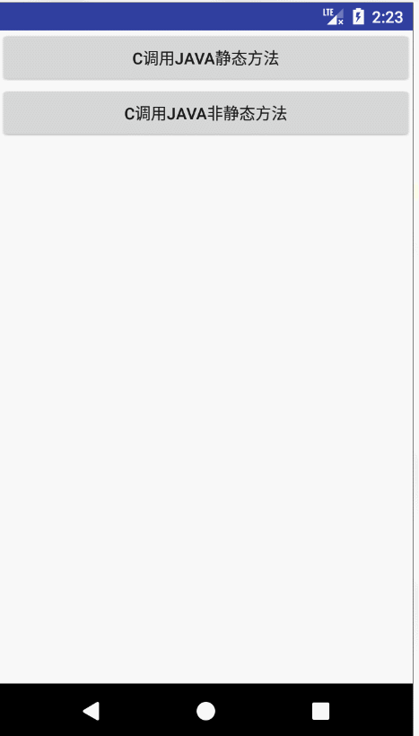

### NDK学习笔记<四> C语言调用java方法

>上篇文章中，我们使用java调用JNI，实现了简单的加减,加密操作，这次我们来看看C语言如何调用java方法。

- 首先是Activity的代码：

```java

/**
 * C 调用 Java 例子
 *
 * @author AFinalStone
 *
 */
public class MainActivity extends Activity {
    //也就是你mk配置文件中的  LOCAL_MODULE    := NDK_04
    private static final String libSoName = "NDK_04";
    private static final String tag = "MainActivity";

    private Button btnClickStatic = null;
    private Button btnClick = null;

    /** Called when the activity is first created. */
    @Override
    public void onCreate(Bundle savedInstanceState) {
        super.onCreate(savedInstanceState);
        setContentView(R.layout.activity_main);
        ToastUtil.register(this);
        //初始化控件
        initViews();
    }

    /**
     * 初始化控件
     */
    private void initViews() {

        btnClickStatic = (Button) this.findViewById(R.id.btn_click_static);
        btnClickStatic.setOnClickListener(new OnClickListener() {

            public void onClick(View v) {
                getTime();
            }
        });

        btnClick = (Button) this.findViewById(R.id.btn_click_noStatic);
        btnClick.setOnClickListener(new OnClickListener() {

            public void onClick(View v) {
                sayHello();
            }
        });


    }

    public native void getTime() ;

    public native void sayHello() ;

    /**
     * 载入JNI生成的so库文件
     */
    static {
        System.loadLibrary(libSoName);
    }

}

```

- 然后是类TestProvider，后面我们就是要C语言中调用TestProvider的静态方法getTime()方法和sayHello(String msg)方法。

```java

public class TestProvider {

    public static String getTime() {
        LogUtil.i("Call From C Java Static Method");
        ToastUtil.show("Call From C To Java Static Method_getTime(获取时间)");
        return String.valueOf(System.currentTimeMillis());
    }

    public void sayHello(String msg) {
        LogUtil.i("Call From C Java Not Static Method ：" + msg);
        ToastUtil.show("Call From C TO Java Not Static Method_sayHello(你好) ：" + msg);
    }
}

```

- 然后是两个工具类LogUtil和ToastUtil

```java
public class LogUtil {

    //可以全局控制是否打印log日志
    private static boolean isPrintLog = true;
    private static int LOG_MAXLENGTH = 2000;


    public static void v(String msg) {
        v("LogUtil", msg);
    }

    public static void v(String tagName, String msg) {
        if (isPrintLog) {
            int strLength = msg.length();
            int start = 0;
            int end = LOG_MAXLENGTH;
            for (int i = 0; i < 100; i++) {
                if (strLength > end) {
                    Log.v(tagName + i, msg.substring(start, end));
                    start = end;
                    end = end + LOG_MAXLENGTH;
                } else {
                    Log.v(tagName + i, msg.substring(start, strLength));
                    break;
                }
            }
        }
    }

    public static void d(String msg) {
        d("LogUtil", msg);
    }
    public static void d(String tagName, String msg) {
        if (isPrintLog) {
            int strLength = msg.length();
            int start = 0;
            int end = LOG_MAXLENGTH;
            for (int i = 0; i < 100; i++) {
                if (strLength > end) {
                    Log.d(tagName + i, msg.substring(start, end));
                    start = end;
                    end = end + LOG_MAXLENGTH;
                } else {
                    Log.d(tagName + i, msg.substring(start, strLength));
                    break;
                }
            }
        }
    }

    public static void i(String msg) {
        i("LogUtil", msg);
    }

    public static void i(String tagName, String msg) {
        if (isPrintLog) {
            int strLength = msg.length();
            int start = 0;
            int end = LOG_MAXLENGTH;
            for (int i = 0; i < 100; i++) {
                if (strLength > end) {
                    Log.i(tagName + i, msg.substring(start, end));
                    start = end;
                    end = end + LOG_MAXLENGTH;
                } else {
                    Log.i(tagName + i, msg.substring(start, strLength));
                    break;
                }
            }
        }
    }

    public static void w(String msg) {
        w("LogUtil", msg);
    }

    public static void w(String tagName, String msg) {
        if (isPrintLog) {
            int strLength = msg.length();
            int start = 0;
            int end = LOG_MAXLENGTH;
            for (int i = 0; i < 100; i++) {
                if (strLength > end) {
                    Log.w(tagName + i, msg.substring(start, end));
                    start = end;
                    end = end + LOG_MAXLENGTH;
                } else {
                    Log.w(tagName + i, msg.substring(start, strLength));
                    break;
                }
            }
        }
    }

    public static void e(String msg) {
        e("LogUtil", msg);
    }
    public static void e(String tagName, String msg) {
        if (isPrintLog) {
            int strLength = msg.length();
            int start = 0;
            int end = LOG_MAXLENGTH;
            for (int i = 0; i < 100; i++) {
                if (strLength > end) {
                    Log.e(tagName + i, msg.substring(start, end));
                    start = end;
                    end = end + LOG_MAXLENGTH;
                } else {
                    Log.e(tagName + i, msg.substring(start, strLength));
                    break;
                }
            }
        }
    }

}
```

```java
/**
 * ToastUtil
 * @author AFinalStone
 */
public class ToastUtil {

    public static Context mContext;

    private ToastUtil() {
        throw new AssertionError();
    }

    public static void register(Context context) {
        mContext = context;
    }


    private static void check() {
        if (mContext == null) {
            throw new NullPointerException(
                    "Must initial call ToastUtils.register(Context context) in your " +
                            "<? " +
                            "extends Application class>");
        }
    }

    public static void show(int resId) {
        check();
        show(mContext.getResources().getText(resId), Toast.LENGTH_SHORT);
    }

    public static void show(int resId, int duration) {
        check();
        show(mContext.getResources().getText(resId), duration);
    }

    public static void show(CharSequence text) {
        check();
        show(text, Toast.LENGTH_SHORT);
    }

    public static void show(CharSequence text, int duration) {
        check();
        Toast.makeText(mContext, text, duration).show();
    }

    public static void show( int resId, Object... args) {
        check();
        show(String.format(mContext.getResources().getString(resId), args), Toast.LENGTH_SHORT);
    }

    public static void show(String format, Object... args) {
        check();
        show(String.format(format, args), Toast.LENGTH_SHORT);
    }

    public static void show(int resId, int duration, Object... args) {
        check();
        show(String.format(mContext.getResources().getString(resId), args), duration);
    }

    public static void show( String format, int duration, Object... args) {
        check();
        show(String.format(format, args), duration);
    }
}

```

最后看一下我们的NDK代码

- CToJava.c代码

```c
#include <string.h>
#include <android/log.h>
#include <jni.h>

/**
 *  把jstring类型转化成char*类型
 */
char* jstringToChar(JNIEnv* env, jstring jstr) {

	char* rtn = NULL;

	jclass clsstring = (*env)->FindClass(env, "java/lang/String");
	jstring strencode = (*env)->NewStringUTF(env, "GB2312");

	jmethodID mid = (*env)->GetMethodID(env,clsstring, "getBytes", "(Ljava/lang/String;)[B");

	jbyteArray barr = (jbyteArray)(*env)->CallObjectMethod(env,jstr,mid,strencode); // String.getByte("GB2312");
	jsize alen = (*env)->GetArrayLength(env, barr);
	jbyte* ba = (*env)->GetByteArrayElements(env, barr, JNI_FALSE);

	if(alen > 0) {
	rtn = (char*)malloc(alen+1); //"\0"
	memcpy(rtn, ba, alen);
	rtn[alen] = 0;
	}

	(*env) -> ReleaseByteArrayElements(env,barr,ba,0);

	return rtn;
}


/**
 *  Java 中 声明的native getTime 方法的实现
 */
JNIEXPORT void JNICALL Java_com_shi_androidstudy_ctojava_MainActivity_getTime(JNIEnv* env, jobject thiz)
{
	__android_log_print(ANDROID_LOG_INFO, "JNIMsg", "开始获取TestProvider.class" );

    // 找到类com.shi.androidstudy.ctojava.TestProvider
    // jclass (*FindClass)(JNIEnv*, const char*);
    jclass clazz_TestProvider = (**env).FindClass(env, "com/shi/androidstudy/ctojava/TestProvider");

    __android_log_print(ANDROID_LOG_INFO, "JNIMsg", "开始获取TestProvider的getTime方法ID" );
    // 得到静态方法   public static String getTime();
    // jmethodID   (*GetStaticMethodID)(JNIEnv*, jclass 类, const char* 方法名, const char* 方法签名(需要使用javap获取方法签名));
    jmethodID methodId_getTime = (**env).GetStaticMethodID(env, clazz_TestProvider, "getTime", "()Ljava/lang/String;");

    __android_log_print(ANDROID_LOG_INFO, "JNIMsg", "GetTime Begin" );
    //jobject     (*CallStaticObjectMethod)(JNIEnv*, jclass, jmethodID, ...);
    jstring jstr = (**env).CallStaticObjectMethod(env, clazz_TestProvider, methodId_getTime);
    char* cstr = jstringToChar(env,jstr);
	__android_log_print(ANDROID_LOG_INFO, "JNIMsg", "Success Get Time from Java , Value = %s",cstr);
	__android_log_print(ANDROID_LOG_INFO, "JNIMsg", "GetTime End" );
	(*env)->ReleaseStringUTFChars(env, jstr, cstr);
	(*env)->DeleteLocalRef(env, jstr);
}


/**
 *  Java 中 声明的native sayHello 方法的实现
 */
JNIEXPORT void JNICALL Java_com_shi_androidstudy_ctojava_MainActivity_sayHello(JNIEnv* env, jobject thiz)
{
	__android_log_print(ANDROID_LOG_INFO, "JNIMsg", "开始获取TestProvider.class" );
    // 找到类com.shi.androidstudy.ctojava.TestProvider
    // jclass (*FindClass)(JNIEnv*, const char*);
	jclass	clazz_TestProvider = (*env)->FindClass(env,"com/shi/androidstudy/ctojava/TestProvider");

	__android_log_print(ANDROID_LOG_INFO, "JNIMsg", "开始获取TestProvider的初始化<init>方法的ID" );
	jmethodID methodID_getObjectInstance = (*env)->GetMethodID(env, clazz_TestProvider,"<init>", "()V");

	__android_log_print(ANDROID_LOG_INFO, "JNIMsg", "开始生成对象实例mTestProvider" );
	jobject object_TestProvider = (*env)->NewObject(env, clazz_TestProvider, methodID_getObjectInstance);

	__android_log_print(ANDROID_LOG_INFO, "JNIMsg", "开始获取TestProvider的sayHello方法ID" );
	jmethodID methodID_sayHello = (*env)->GetMethodID(env, clazz_TestProvider, "sayHello","(Ljava/lang/String;)V");

	jstring jstrMSG = NULL;
	jstrMSG =(*env)->NewStringUTF(env, "Hi,I'm From C");
	__android_log_print(ANDROID_LOG_INFO, "JNIMsg", "SayHello Begin" );
	(*env)->CallVoidMethod(env, object_TestProvider, methodID_sayHello,jstrMSG);
	__android_log_print(ANDROID_LOG_INFO, "JNIMsg", "SayHello End" );
    //删除局部引用
	(*env)->DeleteLocalRef(env, jstrMSG);
}

```

- Android.mk

```mk

LOCAL_PATH := $(call my-dir)

include $(CLEAR_VARS)

LOCAL_C_INCLUDES := $(LOCAL_PATH)/include
LOCAL_LDLIBS += -L$(SYSROOT)/usr/lib -llog


LOCAL_MODULE    := NDK_04
LOCAL_SRC_FILES := CToJava.c

include $(BUILD_SHARED_LIBRARY)

```

编译NDK代码，生成.so文件，不要忘记修改gradle文件，指明.so文件的所在地。然后运行项目，看一下效果图

