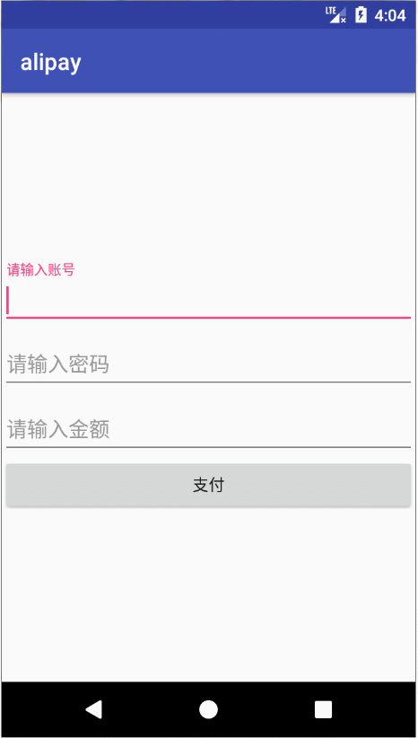

### NDK学习笔记<五> 简单模拟aLiPay支付流程

>上篇文章中，我们实现了C语言调用java方法，这次简单模拟AliPay支付流程。

- 首先是Activity的代码：

```java
package com.shi.androidstudy.alipay;

import android.support.v7.app.AppCompatActivity;
import android.os.Bundle;
import android.view.View;
import android.widget.EditText;
import android.widget.LinearLayout;
import android.widget.TextView;
import android.widget.Toast;

/**
 * @anthor AFinalStone
 * @email:602392033@qq.com
 * @description: 简单模拟aliPay支付流程
 * @time 2017/6/24 11:59
 */
public class MainActivity extends AppCompatActivity {

    private EditText et_account, et_pwd, et_count;
    private LinearLayout linearLayout_progressBar;
    private TextView tv_msg;

    @Override
    protected void onCreate(Bundle savedInstanceState) {
        super.onCreate(savedInstanceState);
        setContentView(R.layout.activity_main);

        // 初始化控件
        initViews();
    }

    private void initViews() {
        et_account = (EditText) findViewById(R.id.et_account);
        et_pwd = (EditText) findViewById(R.id.et_pwd);
        et_count = (EditText) findViewById(R.id.et_count);
        linearLayout_progressBar = (LinearLayout) findViewById(R.id.linearLayout_progressBar);
        tv_msg = (TextView) findViewById(R.id.tv_msg);
    }

    public void onClick(View view) {
        // 拿到数据
        final String account = et_account.getText().toString().trim();
        final String pwd = et_pwd.getText().toString().trim();
        final int count = Integer.parseInt(et_count.getText().toString());

        new Thread() {
            @Override
            public void run() {
                // 调用C语言支付
                int code = pay(account, pwd, count);

                switch (code) {
                    case 0:
                        showMessage("支付成功");
                        break;
                    case 1:
                        showMessage("账号或者密码错误");
                        break;
                    case 2:
                        showMessage("金额超限");
                        break;
                }
            }
        }.start();
    }

    private void showMessage(final String str) {
        runOnUiThread(new Runnable() {

            @Override
            public void run() {
                Toast.makeText(MainActivity.this, str, Toast.LENGTH_SHORT).show();
            }
        });
    }

    public void showProgressBar(final String msg) {

        runOnUiThread(new Runnable() {

            @Override
            public void run() {
                tv_msg.setText(msg);
                linearLayout_progressBar.setVisibility(View.VISIBLE);
            }
        });

    }

    public void hideProgressBar() {

        runOnUiThread(new Runnable() {

            @Override
            public void run() {
                linearLayout_progressBar.setVisibility(View.GONE);
            }
        });
    }

    public static void println(String msg) {
        System.out.println(msg);
    }


    public static String printlnAndBack(String msg) {
        String backStr = "我是返回值:"+msg;
        return backStr;
    }

    /**
     * 账号 abc 密码 123
     * @param account 账号
     * @param pwd 密码
     * @param count 支付金额
     * @return 返回码 (0 支付成功)(1 账号或者密码错误)(2 金额超限 不能超过5000)
     */
    public native int pay(String account, String pwd, int count);

    static {
        System.loadLibrary("alipay");
    }
}

```

然后是NDK代码

- alipay.c代码

```c
#include <jni.h>
#include <stdio.h>
#include <stdlib.h>
#include <android/log.h>
#define LOG_TAG "System.out"
#define LOGD(...) __android_log_print(ANDROID_LOG_DEBUG, LOG_TAG, __VA_ARGS__)
#define LOGI(...) __android_log_print(ANDROID_LOG_INFO, LOG_TAG, __VA_ARGS__)

char* Jstring2CStr(JNIEnv* env, jstring jstr) {

	char* rtn = NULL;

	jclass clsstring = (*env)->FindClass(env, "java/lang/String");
	jstring strencode = (*env)->NewStringUTF(env, "GB2312");

	jmethodID mid = (*env)->GetMethodID(env,clsstring, "getBytes", "(Ljava/lang/String;)[B");

	jbyteArray barr = (jbyteArray)(*env)->CallObjectMethod(env,jstr,mid,strencode); // String.getByte("GB2312");
	jsize alen = (*env)->GetArrayLength(env, barr);
	jbyte* ba = (*env)->GetByteArrayElements(env, barr, JNI_FALSE);

	if(alen > 0) {
	rtn = (char*)malloc(alen+1); //"\0"
	memcpy(rtn, ba, alen);
	rtn[alen] = 0;
	}

	(*env) -> ReleaseByteArrayElements(env,barr,ba,0);

	return rtn;
}

JNIEXPORT jint JNICALL Java_com_shi_androidstudy_alipay_MainActivity_pay
  (JNIEnv *env, jobject obj, jstring account, jstring pwd, jint count) {


    // 找到类com.shi.androidstudy.alipay.MainActivity
    // jclass (*FindClass)(JNIEnv*, const char*);
    jclass clazz = (**env).FindClass(env, "com/shi/androidstudy/alipay/MainActivity");

    // 得到非静态方法   public void showProgressBar(final String msg)和public void hideProgressBar()
    // jmethodID (*GetMethodID)(JNIEnv*, jclass 类, const char* 方法名, const char* 方法签名(需要使用javap获取方法签名;)返回类型);

    jmethodID methodId_showProgressBar = (**env).GetMethodID(env, clazz, "showProgressBar", "(Ljava/lang/String;)V");
    jmethodID methodId_hideProgressBar = (**env).GetMethodID(env, clazz, "hideProgressBar", "()V");

    // 得到静态方法     public static void println(String msg)；
    // jmethodID   (*GetStaticMethodID)(JNIEnv*, jclass 类, const char* 方法名, const char* 方法签名(需要使用javap获取方法签名));
    jmethodID methodId_println = (**env).GetStaticMethodID(env, clazz, "println", "(Ljava/lang/String;)V");
    jmethodID methodId_printlnAndBack = (**env).GetStaticMethodID(env, clazz, "printlnAndBack", "(Ljava/lang/String;)Ljava/lang/String;");


    // 调用获取到的方法
    // void (*CallVoidMethod)(JNIEnv*, jobject, jmethodID, ...);
     jstring msg  =(*env)->NewStringUTF(env, "请稍等...");
    (**env).CallVoidMethod(env, obj, methodId_showProgressBar, msg);

	// 校验账号密码
	LOGD("正在校验账号密码");
	sleep(2);

	// 验证登陆
	LOGD("正在验证登陆");
	sleep(2);

	// 支付
	LOGD("正在支付");
	sleep(2);
    (**env).CallVoidMethod(env, obj, methodId_hideProgressBar);

    sleep(2);
    //void  (*CallStaticVoidMethod)(JNIEnv*, jclass 类, jmethodID 方法名, ...);
    jstring tip  =(*env)->NewStringUTF(env, "操作完成...");
    (**env).CallStaticVoidMethod(env, clazz, methodId_println, tip);

    //jobject     (*CallStaticObjectMethod)(JNIEnv*, jclass, jmethodID, ...);
    jstring tipBack = (**env).CallStaticObjectMethod(env, clazz, methodId_printlnAndBack, tip);
    (**env).CallStaticVoidMethod(env, clazz, methodId_println, tipBack);

	// 拿到C语言可以使用的字符串
	char* pa = Jstring2CStr(env, account);
	char* pp = Jstring2CStr(env, pwd);

	// 定义正确的账号和密码
	char* par = "abc";
	char* ppr = "123";

	// 判断字符串
	int ia = strcmp(pa, par);
	int ip = strcmp(pp, ppr);

	if (ia == 0 && ip == 0) {

		if (count > 5000) {
			// 金额超限
			return 2;
		}

		return 0;

	} else {
		// 账号密码错误
		return 1;
	}
}

```

- Android.mk

```mk
LOCAL_PATH := $(call my-dir)

include $(CLEAR_VARS)

LOCAL_LDLIBS += -llog

LOCAL_MODULE    := alipay
LOCAL_SRC_FILES := alipay.c

include $(BUILD_SHARED_LIBRARY)
```

编译NDK代码，生成.so文件，不要忘记修改gradle文件，指明.so文件的所在地。然后运行项目，看一下效果图



[项目地址](https://github.com/AFinalStone/MYJNI)