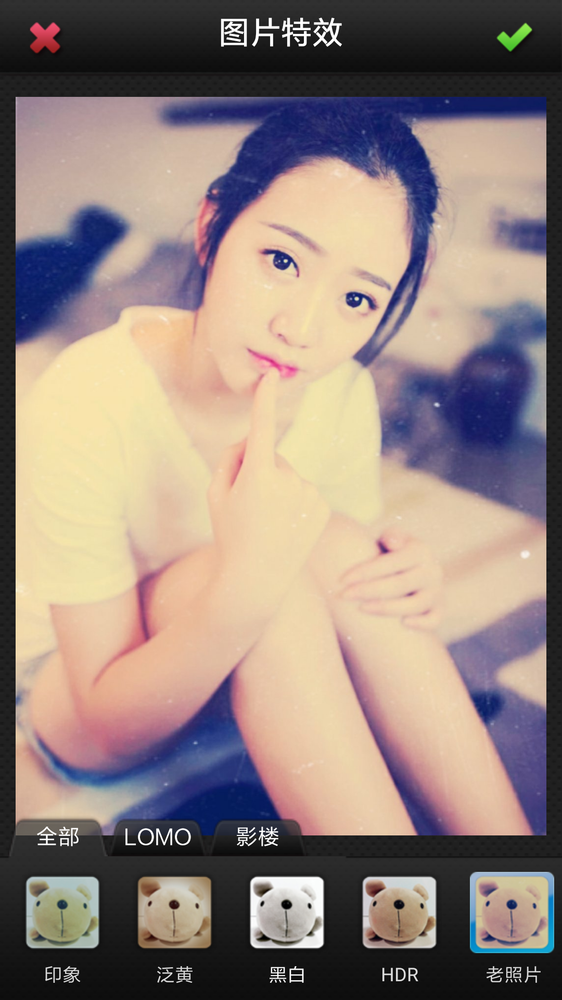
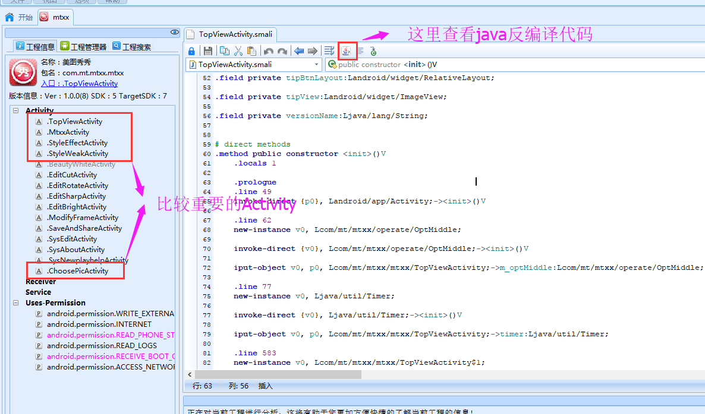
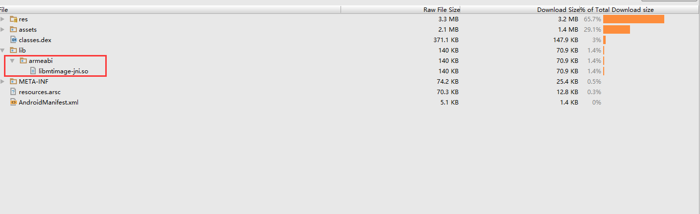
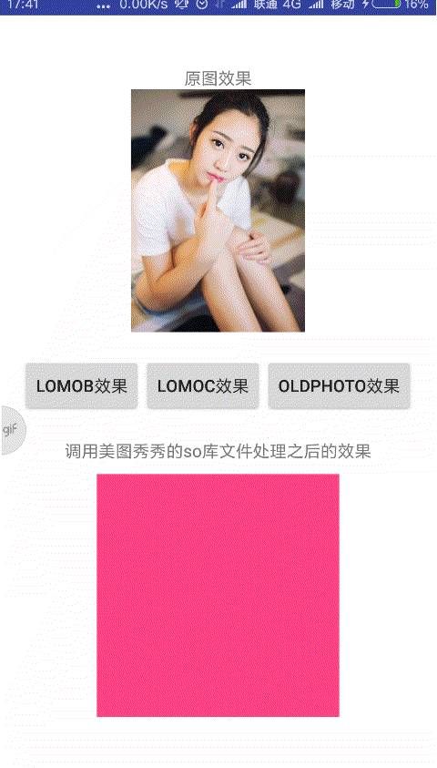

## NDK学习笔记<六> 反编译现成的项目，调用该项目的so文件

这里提供美图秀秀非常早先的一个版本(相关资源文章最后给出)，我们使用AndroidKiller反编译该apk，
然后获取到美图秀秀的源代码以及so库文件，然后尝试在自己的程序中调用美图秀秀的so库文件，
实现美图秀秀美化图片的功能。

### 一、查看美图秀秀的美图效果

首先看一下美图秀秀处理图片的流程和效果，apk安装完毕，可以看到软件logo


接着打开软件，进入美图秀秀首页


点击美化图片按钮，进入图片选择页面


接着点击“从相册选择”按钮，然后选取一张图片


然后选择"特效"按钮，右侧滑动选择“老照片”效果，就可以看到我们想要的图片效果了



### 二、反编译apk获取源代码和so库文件

我们使用反编译软件AndroidKiller对该apk进行反编译，具体下载和反编译请自行百度，很简单，这里就不讲述了

可以看到整个apk项目的整体结构：




### 三、我们在项目中使用美图秀秀的so库文件，实现图片处理的功能



#### 1、复制armeabi文件夹以及so库文件到我们项目的libs目录下面，然后依然要在gradle中设置：

```
    sourceSets {
        main {
            jniLibs.srcDirs = ['libs']
        }
    }
```

#### 2、我们知道的.so库文件中的Java对象中的native方法都是有完整的包名映射路径的，所以我们需要查看美图秀秀中的
native方法都放在哪里，经过分析（为了让文章简单明了，具体分析过程放在后面），我们可以发现全部都集中在一个名字叫做JNI的对象中：

```java
package com.mt.mtxx.image;

public class JNI {
    public native void AutoColor(byte[] paramArrayOfByte, int paramInt1, int paramInt2, int paramInt3, int paramInt4);

    public native void AutoColorLevel(byte[] paramArrayOfByte, int paramInt1, int paramInt2, boolean paramBoolean);

    public native void AutoConstrast(byte[] paramArrayOfByte, int paramInt1, int paramInt2);

    public native void AutoWhiteBalance(byte[] paramArrayOfByte, int paramInt1, int paramInt2);

    public native void BackWeak(byte[] paramArrayOfByte1, byte[] paramArrayOfByte2, int paramInt1, int paramInt2, int[] paramArrayOfInt1, int[] paramArrayOfInt2, int paramInt3, byte[] paramArrayOfByte3, int paramInt4, int paramInt5);

    public native void BackWeak2(byte[] paramArrayOfByte1, int paramInt1, int paramInt2, int paramInt3, int paramInt4, byte[] paramArrayOfByte2, int paramInt5, int paramInt6);

    public native void BackWeakLine(int[] paramArrayOfInt1, int[] paramArrayOfInt2, int paramInt1, int paramInt2, int[] paramArrayOfInt3, int[] paramArrayOfInt4, float paramFloat, int paramInt3, int paramInt4);

    public native void BackWeakOne(int[] paramArrayOfInt1, int[] paramArrayOfInt2, int paramInt1, int paramInt2, int paramInt3, int paramInt4, byte[] paramArrayOfByte, int paramInt5, int paramInt6);

    public native void CColorBalance(boolean paramBoolean, int paramInt1, int paramInt2, int paramInt3, int paramInt4, byte[] paramArrayOfByte, int paramInt5, int paramInt6);

    public native void ColorModeEx(byte[] paramArrayOfByte1, byte[] paramArrayOfByte2);

    public native void CompositeColorEx(byte[] paramArrayOfByte1, byte[] paramArrayOfByte2, double paramDouble);

    public native void DrawEx(byte[] paramArrayOfByte1, byte[] paramArrayOfByte2);

    public native void ExclusionEx(byte[] paramArrayOfByte1, byte[] paramArrayOfByte2, double paramDouble);

    public native void ExclusionEx2(byte[] paramArrayOfByte, byte paramByte1, byte paramByte2, byte paramByte3, double paramDouble);

    public native void FaceBeauty(int[] paramArrayOfInt, int paramInt1, int paramInt2, int paramInt3);

    public native void FaceBeautyRelease();

    public native void FrameXCBK(int[] paramArrayOfInt1, int[] paramArrayOfInt2, int paramInt1, int paramInt2, int paramInt3);

    public native void GaussIIRBlurBrush(int[] paramArrayOfInt, int paramInt1, int paramInt2, int paramInt3, int paramInt4);

    public native void GaussIIRBlurImage(byte[] paramArrayOfByte, int paramInt1, int paramInt2, int paramInt3, int paramInt4);

    public native double GetDegreeByPoints(int paramInt1, int paramInt2, int paramInt3, int paramInt4);

    public native void Grayscale(byte[] paramArrayOfByte, int paramInt1, int paramInt2);

    public native void HardlightEx(byte[] paramArrayOfByte1, byte[] paramArrayOfByte2, double paramDouble);

    public native void ImageColorBurnEx(byte[] paramArrayOfByte1, byte[] paramArrayOfByte2);

    public native void ImageDarkenEx(byte[] paramArrayOfByte1, byte[] paramArrayOfByte2, double paramDouble);

    public native void ImageExclusionEx(byte[] paramArrayOfByte1, byte[] paramArrayOfByte2, double paramDouble);

    public native void ImageLightenEx(byte[] paramArrayOfByte1, byte[] paramArrayOfByte2, double paramDouble);

    public native void ImageNormalEx(byte[] paramArrayOfByte1, byte[] paramArrayOfByte2, double paramDouble);

    public native void ImageOverlayEx(byte[] paramArrayOfByte1, byte[] paramArrayOfByte2, double paramDouble);

    public native void ImageScreenEx(byte[] paramArrayOfByte1, byte[] paramArrayOfByte2, double paramDouble);

    public native void ImageSoftLightEx(byte[] paramArrayOfByte1, byte[] paramArrayOfByte2, double paramDouble);

    public native void LOMO1(int[] paramArrayOfInt1, int paramInt1, int paramInt2, int[] paramArrayOfInt2);

    public native void LOMO2(int[] paramArrayOfInt1, int paramInt1, int paramInt2, int[] paramArrayOfInt2);

    public native void LightEnEx(byte[] paramArrayOfByte1, byte[] paramArrayOfByte2, double paramDouble);

    public native void MakeAllTransparent(byte[] paramArrayOfByte, int paramInt1, int paramInt2);

    public native void MultipleEx(byte[] paramArrayOfByte1, byte[] paramArrayOfByte2, double paramDouble);

    public native void NoiseEx(byte[] paramArrayOfByte, long paramLong);

    public native void NormalEx(byte[] paramArrayOfByte1, byte[] paramArrayOfByte2, double paramDouble);

    public native void OldImage(byte[] paramArrayOfByte1, int paramInt1, int paramInt2, byte[] paramArrayOfByte2, int paramInt3, int paramInt4);

    public native void PinLightEx(byte[] paramArrayOfByte1, byte[] paramArrayOfByte2);

    public native void PtChangeByRotate(byte[] paramArrayOfByte, double paramDouble1, double paramDouble2, double paramDouble3);

    public native void RGBtoXYZ(byte paramByte1, byte paramByte2, byte paramByte3, byte[] paramArrayOfByte);

    public native void RGBtoYIQ(byte paramByte1, byte paramByte2, byte paramByte3, byte[] paramArrayOfByte);

    public native void RGBtoYUV(byte paramByte1, byte paramByte2, byte paramByte3, byte[] paramArrayOfByte);

    public native void Resample(byte[] paramArrayOfByte1, int paramInt1, int paramInt2, int paramInt3, byte[] paramArrayOfByte2, int paramInt4, int paramInt5);

    public native void SSkinbeautify(int[] paramArrayOfInt, int paramInt1, int paramInt2, int paramInt3, int paramInt4, int paramInt5, double paramDouble);

    public native void ScreenEx(byte[] paramArrayOfByte1, byte[] paramArrayOfByte2, double paramDouble);

    public native void SetBackWeakRadius(byte[] paramArrayOfByte, int paramInt1, int paramInt2);

    public native void SetColorImage(byte[] paramArrayOfByte, int paramInt1, int paramInt2, int paramInt3, int paramInt4, int paramInt5);

    public native void SetGrayScaleEx(byte[] paramArrayOfByte);

    public native void Sharp(int[] paramArrayOfInt, int paramInt1, int paramInt2, float paramFloat1, float paramFloat2);

    public native void SharpPreview(int[] paramArrayOfInt, int paramInt1, int paramInt2, float paramFloat1, float paramFloat2);

    public native void SharpPreviewRelease();

    public native void ShiftRGBEx(byte[] paramArrayOfByte, byte paramByte1, byte paramByte2, byte paramByte3);

    public native void SkinWhite(int[] paramArrayOfInt, int paramInt1, int paramInt2, int paramInt3);

    public native void SoftLightEx(byte[] paramArrayOfByte1, byte[] paramArrayOfByte2, double paramDouble);

    public native void StyleBaoColor(int[] paramArrayOfInt, int paramInt1, int paramInt2);

    public native void StyleCinnamon(int[] paramArrayOfInt, int paramInt1, int paramInt2);

    public native void StyleClassic(int[] paramArrayOfInt, int paramInt1, int paramInt2, double paramDouble);

    public native void StyleClassicStudio(int[] paramArrayOfInt, int paramInt1, int paramInt2);

    public native void StyleEP1(int[] paramArrayOfInt1, int[] paramArrayOfInt2, int paramInt1, int paramInt2);

    public native void StyleEP2(int[] paramArrayOfInt1, int[] paramArrayOfInt2, int paramInt1, int paramInt2);

    public native void StyleElegant(int[] paramArrayOfInt, int paramInt1, int paramInt2);

    public native void StyleElegantNew(int[] paramArrayOfInt, int paramInt1, int paramInt2);

    public native void StyleFP1(int[] paramArrayOfInt1, int[] paramArrayOfInt2, int paramInt1, int paramInt2);

    public native void StyleFP2(int[] paramArrayOfInt1, int[] paramArrayOfInt2, int paramInt1, int paramInt2);

    public native void StyleFilm(int[] paramArrayOfInt, int paramInt1, int paramInt2);

    public native void StyleGP1(int[] paramArrayOfInt1, int[] paramArrayOfInt2, int paramInt1, int paramInt2, byte[] paramArrayOfByte, int paramInt3);

    public native void StyleGP2(int[] paramArrayOfInt1, int[] paramArrayOfInt2, int paramInt1, int paramInt2, byte[] paramArrayOfByte, int paramInt3);

    public native void StyleImpression(int[] paramArrayOfInt, int paramInt1, int paramInt2);

    public native void StyleJapanese(int[] paramArrayOfInt, int paramInt1, int paramInt2);

    public native void StyleLomoAP1(int[] paramArrayOfInt1, int[] paramArrayOfInt2, int paramInt1, int paramInt2, byte[] paramArrayOfByte, int paramInt3);

    public native void StyleLomoAP2(int[] paramArrayOfInt1, int[] paramArrayOfInt2, int paramInt1, int paramInt2, byte[] paramArrayOfByte, int paramInt3);

    public native void StyleLomoB(int[] paramArrayOfInt, int paramInt1, int paramInt2);

    public native void StyleLomoBrightRed(int[] paramArrayOfInt1, int[] paramArrayOfInt2, int paramInt1, int paramInt2);

    public native void StyleLomoC(int[] paramArrayOfInt, int paramInt1, int paramInt2);

    public native void StyleLomoChristmas(int[] paramArrayOfInt1, int[] paramArrayOfInt2, int paramInt1, int paramInt2);

    public native void StyleLomoHDR(int[] paramArrayOfInt, int paramInt1, int paramInt2);

    public native void StyleMilk1(int[] paramArrayOfInt1, int[] paramArrayOfInt2, int paramInt1, int paramInt2);

    public native void StyleMilk2(int[] paramArrayOfInt1, int[] paramArrayOfInt2, int paramInt1, int paramInt2);

    public native void StyleMilk3(int[] paramArrayOfInt1, int[] paramArrayOfInt2, int paramInt1, int paramInt2);

    public native void StyleMilk4(int[] paramArrayOfInt1, int[] paramArrayOfInt2, int paramInt1, int paramInt2);

    public native void StyleOldPhoto(int[] paramArrayOfInt1, int[] paramArrayOfInt2, int paramInt1, int paramInt2);

    public native void StyleOldPhotoP1(int[] paramArrayOfInt1, int[] paramArrayOfInt2, int paramInt1, int paramInt2, byte[] paramArrayOfByte, int paramInt3);

    public native void StyleOldPhotoP2(int[] paramArrayOfInt1, int[] paramArrayOfInt2, int paramInt1, int paramInt2, byte[] paramArrayOfByte, int paramInt3);

    public native void StyleRetro(int[] paramArrayOfInt, int paramInt1, int paramInt2);

    public native void XYZtoRGB(byte paramByte1, byte paramByte2, byte paramByte3, byte[] paramArrayOfByte);

    public native void YIQtoRGB(byte paramByte1, byte paramByte2, byte paramByte3, byte[] paramArrayOfByte);

    public native void YUVtoRGB(byte paramByte1, byte paramByte2, byte paramByte3, byte[] paramArrayOfByte);

    public native int add(int paramInt, byte paramByte);

    public native byte[] deal(byte[] paramArrayOfByte, int paramInt1, int paramInt2, int paramInt3, int paramInt4, String paramString);

}

```

这个对象里面包含了所有对图片处理的native方法，我们把这个对象以及他的完成包名全部复制到我们的项目中。

#### 3、编写我们的MainActivity，在里面调用JNI实现对图片的美化功能

```java
package com.afinalstone.administrator.ndk_06_decompilation;

import android.graphics.Bitmap;
import android.graphics.BitmapFactory;
import android.support.v7.app.AppCompatActivity;
import android.os.Bundle;
import android.view.View;
import android.widget.ImageView;

import com.mt.mtxx.image.JNI;

import java.io.InputStream;

public class MainActivity extends AppCompatActivity {

    static {
        System.loadLibrary("mtimage-jni");
    }

    private ImageView imageView_result;
    private JNI jni;
    private Bitmap bitmap;

    @Override
    protected void onCreate(Bundle savedInstanceState) {
        super.onCreate(savedInstanceState);
        setContentView(R.layout.activity_main);
        imageView_result = (ImageView) findViewById(R.id.imageView_result);
        jni = new JNI();
        InputStream is = getResources().openRawResource(R.mipmap.timg);
        bitmap = BitmapFactory.decodeStream(is);
    }

    public void onClick(View view) {
        int width = bitmap.getWidth();
        int height = bitmap.getHeight();
        int[] pixels = new int[width * height];
        bitmap.getPixels(pixels, 0, width, 0, 0, width, height);
        switch (view.getId()) {
            case R.id.btn_LomoB:
                jni.StyleLomoB(pixels, width, height);
                break;
            case R.id.btn_LomoC:
                jni.StyleLomoC(pixels, width, height);
                break;
            case R.id.btn_StyleOldPhoto:
                jni.StyleOldPhoto(pixels, pixels, width, height);
                break;
        }

        // 用处理好的像素数组 创建一张新的图片就是经过特效处理的，然后重新设置给ImageView控件
        Bitmap bitmap_result = Bitmap.createBitmap(pixels, width, height, bitmap.getConfig());
        imageView_result.setImageBitmap(bitmap_result);
    }
}

```

代码中可知，我们首先在static静态代码块加载库文件，然后初始化一个JNI的对象，并获取到图片资源文件timg的Bitmap对象，
接着在按钮的点击事件中，使用JNI的Navite方法对获取到的bitmap进行处理，生成新的Bitmap，然后重新设置给下面的ImageView控件。
效果图如下：



### 四、分析

早期的apk并没有现在放黑加固加壳之类的防范措施(看看现在的加固和安全基本都是做的一层又一层。。。)，
所以反编译之后，我们可以非常清楚的看到项目的入口是TopViewActivity：


#### 1、TopViewActivity的关键代码：


```markdown
public class TopViewActivity
  extends Activity
{
  public static int backID;
  public int Background;
  private Button btn_about;
  //注释：对应“美化图片”按钮
  private Button btn_beautyPic;
  private Button btn_newboyhelp;
  private Button btn_set;
  private TextView btn_versionName;
  private LinearLayout buttonsLayout;

  ...代码省略...

  public void onCreate(Bundle paramBundle)
  {
    getWindow().setFlags(1024, 1024);
    super.onCreate(paramBundle);
    setContentView(2130903055);
    findView();
    this.tipAnimation = AnimationUtils.loadAnimation(this, 2130968592);
    //注释：为“美化图片”按钮设置点击事件
    this.btn_beautyPic.setOnClickListener(new OnClickListenerBeautyPic());
    this.btn_beautyPic.setOnTouchListener(new OnTouchListenerBeautyPic());
    this.btn_newboyhelp.setOnTouchListener(new OnTouchListenerNewboyhelp());
    this.btn_newboyhelp.setOnClickListener(new OnClickListenerNewboyhelp());
    this.btn_about.setOnTouchListener(new OnTouchListenerAbout());
    this.btn_about.setOnClickListener(new OnClickListenerAbout());
    this.btn_set.setOnTouchListener(new OnTouchListenerSet());
    this.btn_set.setOnClickListener(new OnClickListenerSet());
    getName();
    this.btn_versionName.setText(this.versionName + " 正式版");
    this.btn_versionName.setTextSize(12.0F);
  }
  
  ...代码省略...
  
  class OnClickListenerBeautyPic
    implements View.OnClickListener
  {
    OnClickListenerBeautyPic() {}
    
    public void onClick(View paramView)
    {
       //注释：这里是“美化图片”按钮的点击事件，打开ChoosePicActivity页面,这样我们就去看ChoosePicActivity的具体代码
      paramView = new Intent(TopViewActivity.this, ChoosePicActivity.class);
      TopViewActivity.this.startActivity(paramView);
      TopViewActivity.this.overridePendingTransition(2130968576, 2130968577);
    }
  }
  
  ...代码省略...

}
```

上面代码对“美化图片”按钮进行点击事件设置，开启了一个名叫ChoosePicActivity的新Activity。

#### 2、ChoosePicActivity的关键代码：


ChoosePicActivity在初始化的时候创建一个ChoosePicDialog对话框，然后在ChoosePicDialog里面我们选择从相册中选择按钮之后，
在成功获取到用户选择的相册图片路径之后，重新回调到了ChoosePicActivity对象的onActivityResult，接着进入到
美图秀秀的具体效果设置修改页面MtxxActivity对象中。

```java

public class ChoosePicActivity
  extends Activity
{
   //注释：弹出一个选择图片的对话框
  private ChoosePicDialog mChooseDialog;

  
  private void setBtns()
  {
    ImageTestButton localImageTestButton1 = (ImageTestButton)findViewById(2131230785);
    ImageTestButton localImageTestButton2 = (ImageTestButton)findViewById(2131230786);
    ImageTestButton localImageTestButton3 = (ImageTestButton)findViewById(2131230787);
    ImageTestButton localImageTestButton4 = (ImageTestButton)findViewById(2131230788);
    ImageTestButton localImageTestButton5 = (ImageTestButton)findViewById(2131230789);
    localImageTestButton1.setResources(2130837588, 2130837589);
    localImageTestButton2.setResources(2130837586, 2130837587);
    localImageTestButton3.setResources(2130837594, 2130837595);
    localImageTestButton4.setResources(2130837590, 2130837591);
    localImageTestButton5.setResources(2130837592, 2130837593);
  }

  //这里在弹出ChoosePicDialog选择对话框之后，会使用startActivityForResult打开系统选择相册的页面，
  //然后在这里获取到具体的回调结果，可以拿到用户选择的图片具体路径
  protected void onActivityResult(int paramInt1, int paramInt2, Intent paramIntent)
  {
    do
    {
      do
      {
        try
        {
          MTDebug.Print("requestCode=" + paramInt1 + " resultCode=" + paramInt2);
          if ((paramInt1 != 0) || (paramInt2 != -1)) {
            continue;
          }
          if (this.mChooseDialog != null)
          {
            this.mChooseDialog.dismiss();
            this.mChooseDialog = null;
          }
          MtxxActivity.fromCamera = true;
          toMtxxActivity();
        }
        catch (Exception localException1)
        {
          for (;;)
          {
            Uri localUri;
            Cursor localCursor;
            localException1.printStackTrace();
            continue;
            try
            {
              MtxxActivity.loadPic = true;
              MyData.picSourceType = 0;
              toMtxxActivity();
            }
            catch (Exception localException2)
            {
              localException2.printStackTrace();
            }
            continue;
            if (localException2 != null)
            {
              String str = localException2.getPath();
              MTDebug.Print("path=" + str);
              MyData.strPicPath = str;
              try
              {
                MyData.bmpDst = null;
                System.gc();
                MtxxActivity.loadPic = true;
                MyData.picSourceType = 0;
                toMtxxActivity();
              }
              catch (Exception localException3)
              {
                localException3.printStackTrace();
              }
            }
          }
        }
        super.onActivityResult(paramInt1, paramInt2, paramIntent);
        return;
      } while ((paramInt1 != 1) || (paramInt2 != -1));
      if (this.mChooseDialog != null)
      {
        this.mChooseDialog.dismiss();
        this.mChooseDialog = null;
      }
    } while (paramIntent == null);
    localUri = paramIntent.getData();
    localCursor = getContentResolver().query(localUri, null, null, null, null);
    if (localCursor != null)
    {
      localCursor.moveToFirst();
      MyData.strPicPath = localCursor.getString(1);
      MTDebug.Print("MyData.strPicPath      " + MyData.strPicPath);
      if (!new File(MyData.strPicPath).exists())
      {
        finish();
        Toast.makeText(this, "加载图片失败", 0).show();
        MyPro.allScan(this);
        return;
      }
    }
  }
  
  protected void onCreate(Bundle paramBundle)
  {
    getWindow().setFlags(1024, 1024);
    super.onCreate(paramBundle);
    setContentView(2130903046);
    System.gc();
    setBtns();//设置按钮的显示样式
    this.mChooseDialog = new ChoosePicDialog(this);
    this.mChooseDialog.setDisplay();//创建一个ChoosePicDialog对话框并显示出来
    MTDebug.memeryUsed("ChoosePicActivity onCreate");
  }

   ...代码省略...
  
  //注释：进入到美图秀秀的具体效果设置修改页面，我们接着查看MtxxActivity的具体代码
  public void toMtxxActivity()
  {
    try
    {
      Intent localIntent = new Intent();
      localIntent.setClass(this, MtxxActivity.class);
      startActivity(localIntent);
      finish();
      overridePendingTransition(2130968577, 2130968578);
      return;
    }
    catch (Exception localException)
    {
      localException.printStackTrace();
    }
  }
}


````

#### 3、ChoosePicDialog对话框的具体代码

```java

public class ChoosePicDialog
  extends Dialog
  implements View.OnClickListener, View.OnTouchListener
{
  private static Context context;
  public static Window window = null;
  //注释：这个按钮是我们需要的，对应“从相册中选择”按钮，我们查看他的点击事件
  private Button btn_choosePic_choosePic = null;
  private Button btn_choosePic_photograph = null;
  private Button btn_choosePic_returnLast = null;
  private Button btn_choosePic_returnMainView = null;
  private File f;
  private boolean isProcessing = false;
  private String lastPicPath;
  
  public ChoosePicDialog(Context paramContext)
  {
    super(paramContext);
    context = paramContext;
  }
  
  private void findView()
  {
    this.btn_choosePic_returnLast = ((Button)findViewById(2131230727));
    this.btn_choosePic_choosePic = ((Button)findViewById(2131230729));
    this.btn_choosePic_photograph = ((Button)findViewById(2131230731));
    this.btn_choosePic_returnMainView = ((Button)findViewById(2131230733));
  }
  
  private void initData()
  {
    try
    {
      MyData.m_optMiddle.m_pHistory = OptHistoryTools.ReadOptHistory();
      if (MyData.m_optMiddle.m_pHistory != null)
      {
        String str = MyData.m_optMiddle.m_pHistory.GetPicPath(MyData.m_optMiddle.m_pHistory.m_nDoneListPos);
        if (str != null)
        {
          MTDebug.Print("returnLastOpt index=" + str);
          this.lastPicPath = ("/sdcard/.MTXX/HISTORY/" + str + ".jpg");
          this.f = new File(this.lastPicPath);
          MTDebug.Print("MyData.m_optMiddle.m_pHistory.strPicPath" + MyData.m_optMiddle.m_pHistory.getStrPicPath());
          MyData.strPicPath = MyData.m_optMiddle.m_pHistory.getStrPicPath();
          MyData.fScaleCut = MyData.m_optMiddle.m_pHistory.getfScaleCut();
          MyData.nPicDstWidth = MyData.m_optMiddle.m_pHistory.getnPicDstWidth();
          if ((this.f.exists()) && (MyData.strPicPath != null)) {
            return;
          }
          MTDebug.Print("File is null");
          this.btn_choosePic_returnLast.setBackgroundResource(2130837597);
          this.btn_choosePic_returnLast.setEnabled(false);
          return;
        }
      }
      this.btn_choosePic_returnLast.setBackgroundResource(2130837597);
      this.btn_choosePic_returnLast.setEnabled(false);
      return;
    }
    catch (Exception localException)
    {
      localException.printStackTrace();
    }
  }

 ...代码省略...
  
  private void setListener()
  {
    this.btn_choosePic_returnLast.setOnClickListener(this);
    //设置按钮点击事件
    this.btn_choosePic_choosePic.setOnClickListener(this);
    this.btn_choosePic_photograph.setOnClickListener(this);
    this.btn_choosePic_returnMainView.setOnClickListener(this);
    this.btn_choosePic_returnLast.setOnTouchListener(this);
    this.btn_choosePic_choosePic.setOnTouchListener(this);
    this.btn_choosePic_photograph.setOnTouchListener(this);
    this.btn_choosePic_returnMainView.setOnTouchListener(this);
  }
  
  //注释：这里使用startActivityForResult选择图片之后，获取到图片的具体路径，然后回回调给之前的ChooseActivity的onActivityResult方法中
  public void choosePic()
  {
    try
    {
      Intent localIntent = new Intent();
      localIntent.setType("image/*");
      localIntent.setAction("android.intent.action.GET_CONTENT");
      ((Activity)context).startActivityForResult(localIntent, 1);
      return;
    }
    catch (Exception localException)
    {
      localException.printStackTrace();
    }
  }

   //注释：按钮响应事件，
  public void onClick(View paramView)
  {
    if (this.isProcessing) {
      return;
    }
    this.isProcessing = true;
    if (paramView.getId() == 2131230727) {
      returnLastOpt(context);
    }
    for (;;)
    {
      this.isProcessing = false;
      return;
      if (paramView.getId() == 2131230729)
      {
      //注释：按钮响应事件，选择图片
        choosePic();
      }
      else if (paramView.getId() == 2131230731)
      {
        photograph(context);
      }
      else if (paramView.getId() == 2131230733)
      {
        dismiss();
        ((Activity)context).finish();
        ((Activity)context).overridePendingTransition(2130968577, 2130968578);
      }
    }
  }
  

 ...代码省略...
  
  public void setDisplay()
  {
    setContentView(2130903041);
    setProperty();  //设置样式
    findView();     //findViewById
    setListener();  //设置监听事件
    initData();     //初始化相关数据
    show();         //先是选择图片的对话框
  }

  public void setProperty()
  {
    window = getWindow();
    WindowManager.LayoutParams localLayoutParams = window.getAttributes();
    localLayoutParams.x = 0;
    localLayoutParams.y = 0;
    window.setBackgroundDrawableResource(2130837513);
    window.setAttributes(localLayoutParams);
  }

}

```

#### 4、MtxxActivity的具体代码：


```java

public class MtxxActivity extends Activity
{

  ...代码省略...
  
  private ImageTestButton btn_effect;
  
  ...代码省略...

  protected void onCreate(Bundle paramBundle)
  {
    super.onCreate(paramBundle);
    getWindow().setFlags(1024, 1024);
    setContentView(2130903047);
    System.gc();
    if ((MyData.nScreenW == 0) || (MyData.nScreenH == 0) || (MyData.nDensity == 0.0F))
    {
      paramBundle = getWindowManager().getDefaultDisplay();
      localObject = new DisplayMetrics();
      paramBundle.getMetrics((DisplayMetrics)localObject);
      MyData.nScreenW = ((DisplayMetrics)localObject).widthPixels;
      MyData.nScreenH = ((DisplayMetrics)localObject).heightPixels;
      MyData.nBmpDstW = MyData.nScreenW;
      MyData.nBmpDstH = MyData.nScreenH - 100;
      MyData.nDensity = ((DisplayMetrics)localObject).density;
      MTDebug.Print("MTXXActivity onCreate MyData.nScreenW=" + MyData.nScreenW + " MyData.nScreenH=" + MyData.nScreenH + " MyData.nDensity=" + MyData.nDensity);
    }
    MTDebug.Print("MTXXActivity1 onCreate MyData.nScreenW=" + MyData.nScreenW + " MyData.nScreenH=" + MyData.nScreenH + " MyData.nDensity=" + MyData.nDensity);
    this.viewmain = ((ViewMain)findViewById(2131230795));
    paramBundle = (Button)findViewById(2131230791);
    this.btn_last = ((Button)findViewById(2131230793));
    this.btn_next = ((Button)findViewById(2131230794));
    Object localObject = (Button)findViewById(2131230792);
    this.btn_edit = ((ImageTestButton)findViewById(2131230803));
    this.btn_edit.setResources(2130837588, 2130837589);
    this.btn_color = ((ImageTestButton)findViewById(2131230804));
    this.btn_color.setResources(2130837586, 2130837587);
    this.btn_weak = ((ImageTestButton)findViewById(2131230805));
    this.btn_weak.setResources(2130837594, 2130837595);
    //初始化
    this.btn_effect = ((ImageTestButton)findViewById(2131230806));
    this.btn_effect.setResources(2130837590, 2130837591);

    this.btn_frame = ((ImageTestButton)findViewById(2131230807));
    this.btn_frame.setResources(2130837592, 2130837593);
    paramBundle.setOnClickListener(new ClickListenerReturn());
    paramBundle.setOnTouchListener(new onTouchListenerReturn());
    this.btn_last.setOnClickListener(new ClickListenerLast());
    this.btn_last.setOnTouchListener(new onTouchListenerLast());
    this.btn_next.setOnClickListener(new ClickListenerNext());
    this.btn_next.setOnTouchListener(new onTouchListenerNext());
    ((Button)localObject).setOnClickListener(new ClickListenerSave());
    ((Button)localObject).setOnTouchListener(new onTouchListenerSave());
    this.btn_edit.setOnClickListener(new ClickListenerEdit(null));
    this.btn_color.setOnClickListener(new ClickListenerColor());
    this.btn_weak.setOnClickListener(new ClickListenerWeak());

    this.btn_effect.setOnClickListener(new ClickListenerEffect());//设置监听方法

      ...代码省略...
      
  }

      ...代码省略...

  //对图片进行编辑
  public void toEdit(int paramInt)
  {
    for (;;)
    {
      try
      {
        localIntent = new Intent();
        switch (paramInt)
        {
        case 1100: 
          localIntent.putExtra("type", paramInt);
          startActivityForResult(localIntent, paramInt);
          overridePendingTransition(2130968576, 2130968577);
          return;
        }
      }
      catch (Exception localException)
      {
        Intent localIntent;
        localException.printStackTrace();
        return;
      }
      localIntent.setClass(this, EditCutActivity.class);
      continue;
      localException.setClass(this, EditRotateActivity.class);
      continue;
      localException.setClass(this, EditBrightActivity.class);
      continue;
      localException.setClass(this, EditSharpActivity.class);
      continue;
      //进入StyleEffectActivity对象
      localException.setClass(this, StyleEffectActivity.class);
      continue;
      localException.setClass(this, StyleWeakActivity.class);
      continue;
      localException.setClass(this, ModifyFrameActivity.class);
    }
  }

  ...代码省略...
  
  //点击事件监听对象
  class ClickListenerEffect implements View.OnClickListener
  {
    ClickListenerEffect() {}
    
    public void onClick(View paramView)
    {
      if (!MtxxActivity.this.btn_effect.isDown)
      {
        MtxxActivity.this.btn_effect.isDown = true;
        MtxxActivity.this.btn_effect.changeBtnState(true);
        MtxxActivity.this.menuView.setVisibility(4);
        MtxxActivity.this.btn_edit.isDown = false;
        MtxxActivity.this.btn_color.isDown = false;
        MtxxActivity.this.btn_weak.isDown = false;
        MtxxActivity.this.btn_frame.isDown = false;
        MtxxActivity.this.btn_effect.setBackgroundResource(2130837702);
        MtxxActivity.this.btn_edit.setBackgroundDrawable(null);
        MtxxActivity.this.btn_color.setBackgroundDrawable(null);
        MtxxActivity.this.btn_weak.setBackgroundDrawable(null);
        MtxxActivity.this.btn_frame.setBackgroundDrawable(null);
      }
      MtxxActivity.this.toEdit(1200);//调用toEdit，进入编辑页面
    }
  }
  ...代码省略...
}

```

上面的代码我们主要讲解一个按钮，就是特效按钮，从代码中我们可以发现对这个按钮设置点击事件，然后调用toEdit()方法，
紧接着进入StyleEffectActivity对象中。

#### 5、StyleEffectActivity的具体代码:


```java

public class StyleEffectActivity
  extends Activity
  implements AdapterView.OnItemClickListener
{

  private Button alleffectlable;//“全部”按钮
  private boolean canTouch = false;
  private float density = MyData.nDensity;
  private ProgressBar effectBar;
  private GalleryText effectGallery;//实现textView横排显示的效果
  private ViewEditGalleryText fakeEffectView;
  private boolean isProcessing = false;
  private Animation lastFakeAnimation;
  private Animation lastPicAnimation;
  private Button lomoeffectlable;//“LOMO”按钮
  Handler myHandler = new Handler()
  {
    public void handleMessage(Message paramAnonymousMessage)
    {
      switch (paramAnonymousMessage.what)
      {
      }
      for (;;)
      {
        super.handleMessage(paramAnonymousMessage);
        return;
        StyleEffectActivity.this.setGone();
        //如果图片处理结束，调用viewEffect对象的updateShow()方法进行控件刷新
        StyleEffectActivity.this.viewEffect.updateShow();
      }
    }
  };
  private int[] nGalleryLomo;
  private int[] nGalleryStdio;
  private int nSelectBmp = 0;
  int nTextLength;
  private int nType;
  private Animation nextFakeAnimation;
  private Animation nextPicAnimation;
  private boolean noPic = false;
  private Button photoeffectlable;//“影楼”按钮
  private int[] sListTest;
  private int[] strAlleffect = { 2130837657, 2130837658, 2130837659, 2130837660, 2130837661, 2130837662, 2130837663, 2130837664, 2130837665, 2130837666, 2130837667, 2130837668, 2130837669, 2130837670, 2130837671, 2130837672, 2130837673 };
  private int[] strAlleffects = { 2130837675, 2130837676, 2130837677, 2130837678, 2130837679, 2130837680, 2130837681, 2130837682, 2130837683, 2130837684, 2130837685, 2130837686, 2130837687, 2130837688, 2130837689, 2130837690, 2130837691 };
  Thread threadWait = null;
  public int touchType = -1;
  private ViewEditGalleryText viewEffect;//图片处理和展示的效果控件
  private int xDownSize;
  private int xUpSize;
  
  static
  {
    lastBmp = 0;
    beforeType = 0;
    System.loadLibrary("mtimage-jni");
  }

  ...代码省略...

  protected void onCreate(Bundle paramBundle)
  {
    getWindow().setFlags(1024, 1024);
    super.onCreate(paramBundle);
    setContentView(2130903050);
    System.gc();
    this.nType = getIntent().getIntExtra("type", -1);
    if ((MyData.nScreenW == 0) || (MyData.nScreenH == 0) || (MyData.nDensity == 0.0F))
    {
      paramBundle = getWindowManager().getDefaultDisplay();
      DisplayMetrics localDisplayMetrics = new DisplayMetrics();
      paramBundle.getMetrics(localDisplayMetrics);
      MyData.nScreenW = localDisplayMetrics.widthPixels;
      MyData.nScreenH = localDisplayMetrics.heightPixels;
      MyData.nBmpDstW = MyData.nScreenW;
      MyData.nBmpDstH = MyData.nScreenH - 100;
      MyData.nDensity = localDisplayMetrics.density;
      MTDebug.Print("MTXXActivity onCreate MyData.nScreenW=" + MyData.nScreenW + " MyData.nScreenH=" + MyData.nScreenH + " MyData.nDensity=" + MyData.nDensity);
      this.density = MyData.nDensity;
    }
    this.viewEffect = ((ViewEditGalleryText)findViewById(2131230856));
    this.viewEffect.nType = this.nType;
    this.alleffectlable = ((Button)findViewById(2131230859));
    this.lomoeffectlable = ((Button)findViewById(2131230860));
    this.photoeffectlable = ((Button)findViewById(2131230861));
    this.alleffectlable.setOnClickListener(new OnClassListenerAlleffectlable());
    this.lomoeffectlable.setOnClickListener(new OnClassListenerLomoeffectlable());//“LOMO”按钮设置点击事件
    this.photoeffectlable.setOnClickListener(new OnClassListenerPhotoeffectlable());//“影楼”按钮设置点击事件
    this.nGalleryLomo = new int[11];
    this.nGalleryLomo[0] = 0;
    this.nGalleryLomo[1] = 1;
    this.nGalleryLomo[2] = 16;
    this.nGalleryLomo[3] = 3;
    this.nGalleryLomo[4] = 4;
    this.nGalleryLomo[5] = 8;
    this.nGalleryLomo[6] = 11;
    this.nGalleryLomo[7] = 14;
    this.nGalleryLomo[8] = 12;
    this.nGalleryLomo[9] = 13;
    this.nGalleryLomo[10] = 15;
    this.nGalleryStdio = new int[7];
    this.nGalleryStdio[0] = 0;
    this.nGalleryStdio[1] = 2;
    this.nGalleryStdio[2] = 5;
    this.nGalleryStdio[3] = 6;
    this.nGalleryStdio[4] = 7;
    this.nGalleryStdio[5] = 10;
    this.nGalleryStdio[6] = 9;
    this.effectBar = ((ProgressBar)findViewById(2131230862));
    this.effectGallery = ((GalleryText)findViewById(2131230858));
    effectType = 0;
    setGalleryImages(effectType);
    setGalleryImages(effectType, 0, true);
    set(0);
    this.effectGallery.setOnItemClickListener(this);//设置自条目点击事件监听对象
    this.effectGallery.setOnTouchListener(new OnTouchListenerGallery());
    paramBundle = (ImageButton)findViewById(2131230852);
    paramBundle.setOnClickListener(new myClickListenerDelete());
    paramBundle.setOnTouchListener(new onTouchListenerDelete());
    paramBundle = (ImageButton)findViewById(2131230853);
    paramBundle.setOnClickListener(new myClickListenerOk());
    paramBundle.setOnTouchListener(new onTouchListenerOk());
    this.fakeEffectView = ((ViewEditGalleryText)findViewById(2131230855));
    this.fakeEffectView.recycleBmpsrc();
    this.nextPicAnimation = AnimationUtils.loadAnimation(this, 2130968583);
    this.lastPicAnimation = AnimationUtils.loadAnimation(this, 2130968581);
    this.nextFakeAnimation = AnimationUtils.loadAnimation(this, 2130968585);
    this.lastFakeAnimation = AnimationUtils.loadAnimation(this, 2130968582);
    MTDebug.memeryUsed("StyleEffectActivity onCreate");
  }

    ...代码省略...

  public void onItemClick(AdapterView<?> paramAdapterView, View paramView, int paramInt, long paramLong)
  {
    if (this.isProcessing) {
      return;
    }
    set(paramInt);
  }

  ...代码省略...

  //底部横排的TextView被点击的时候调用，
  public void set(int paramInt)
  {
    for (;;)
    {
      try
      {
        System.gc();
        MTDebug.memeryUsed("StyleEffectActivity set arg=" + paramInt);
        if (effectType != 0) {
          break label238;
        }
        nCurGallerySelect = paramInt + 2099;
        MTDebug.Print("nSelectBmp =" + this.nSelectBmp + "arg" + paramInt);
        if ((this.nSelectBmp == paramInt) && (effectType == beforeType)) {
          break label225;
        }
        setGalleryImages(effectType, paramInt, true);
        if (paramInt == 0)
        {
          MTDebug.Print("set arg == 0");
          this.viewEffect.showProcess(nCurGallerySelect);
          this.viewEffect.processEffect(nCurGallerySelect);
          this.viewEffect.refresh();
          System.gc();
          return;
        }
        if (!this.viewEffect.isUsed(nCurGallerySelect))
        {
          setVisible();
          new Thread(new myThread()).start();
          this.viewEffect.showProcess(nCurGallerySelect);
          continue;
        }
        this.viewEffect.showProcess(nCurGallerySelect);
      }
      catch (Exception localException)
      {
        localException.printStackTrace();
        return;
      }
      this.viewEffect.processEffect(nCurGallerySelect);
      this.viewEffect.refresh();
      continue;
      label225:
      setGalleryImages(effectType, paramInt, true);
      continue;
      label238:
      if (effectType == 1)//这里我猜测是对应LOMO效果
      {
        MTDebug.Print("nSelectBmp =" + this.nSelectBmp + "arg" + paramInt);
        if ((this.nSelectBmp != paramInt) || (effectType != beforeType))
        {
          nCurGallerySelect = this.nGalleryLomo[paramInt] + 2099;
          if (!this.viewEffect.isUsed(nCurGallerySelect))
          {
            setVisible();
            new Thread(new myThread()).start();//开启一个线程,在这个线程中对图片进行美化处理，我们查看myThread做了什么
            this.viewEffect.showProcess(nCurGallerySelect);//显示一个还在进度条
          }
          for (;;)
          {
            setGalleryImages(effectType, paramInt, true);
            break;
            this.viewEffect.showProcess(nCurGallerySelect);
            this.viewEffect.processEffect(nCurGallerySelect);
            this.viewEffect.refresh();
          }
        }
        setGalleryImages(effectType, paramInt, true);
      }
      else if (effectType == 2)
      {
        MTDebug.Print("nSelectBmp =" + this.nSelectBmp + "arg" + paramInt);
        if ((this.nSelectBmp != paramInt) || (effectType != beforeType))
        {
          nCurGallerySelect = this.nGalleryStdio[paramInt] + 2099;
          if (!this.viewEffect.isUsed(nCurGallerySelect))
          {
            setVisible();
            new Thread(new myThread()).start();
            this.viewEffect.showProcess(nCurGallerySelect);
          }
          for (;;)
          {
            setGalleryImages(effectType, paramInt, true);
            break;
            this.viewEffect.showProcess(nCurGallerySelect);
            this.viewEffect.processEffect(nCurGallerySelect);
            this.viewEffect.refresh();
          }
        }
        setGalleryImages(effectType, paramInt, true);
      }
    }
  }

  public boolean setGalleryImages(int paramInt1, int paramInt2, boolean paramBoolean)
  {

     ...代码省略...
     
     this.effectGallery.setAdapter(new ImageApdater(this));//设置适配器
     
     ...代码省略...
  }

   ...代码省略...

  public class ImageApdater
    extends BaseAdapter
  {
    private Context myContext;
    
    public ImageApdater(Context paramContext)
    {
      this.myContext = paramContext;
    }
    
    public int getCount()
    {
      return StyleEffectActivity.nGalleryButtonNum;
    }
    
    public Object getItem(int paramInt)
    {
      return Integer.valueOf(paramInt);
    }
    
    public long getItemId(int paramInt)
    {
      return paramInt;
    }
    
    public View getView(int paramInt, View paramView, ViewGroup paramViewGroup)
    {
      localCanvas = null;
      for (;;)
      {
        try
        {
          MTDebug.Print("Get Viewposition~~~~~~" + paramInt);
          paramViewGroup = new ImageView(this.myContext);
          try
          {
            paramView = Bitmap.createBitmap((int)(66.0F * StyleEffectActivity.this.density), (int)(78.0F * StyleEffectActivity.this.density), Bitmap.Config.ARGB_8888);
            localCanvas = new Canvas(paramView);
            Object localObject = ImageProcess.FittingWindow888(BitmapFactory.decodeResource(StyleEffectActivity.this.getResources(), StyleEffectActivity.this.sListTest[paramInt]), (int)(54.0F * StyleEffectActivity.this.density), (int)(52.0F * StyleEffectActivity.this.density), true);
            localCanvas.drawBitmap((Bitmap)localObject, 5.0F * StyleEffectActivity.this.density, 0.0F, null);
            if ((localObject != null) && (!((Bitmap)localObject).isRecycled())) {
              ((Bitmap)localObject).recycle();
            }
            localObject = new Paint(1);
            ((Paint)localObject).setStyle(Paint.Style.FILL);
            ((Paint)localObject).setColor(-1);
            ((Paint)localObject).setTextSize(12.0F * StyleEffectActivity.this.density);
            str = StyleEffectActivity.this.getResources().getString(StyleEffectActivity.nGalleryButtonTextId[paramInt]);
            if (StyleEffectActivity.this.getCharsLength(str) == 3)
            {
              StyleEffectActivity.this.nTextLength = ((int)(20.0F * StyleEffectActivity.this.density));
              localCanvas.drawText(str, StyleEffectActivity.this.nTextLength, 70.0F * StyleEffectActivity.this.density, (Paint)localObject);
              paramViewGroup.setImageBitmap(paramView);
              paramViewGroup.setScaleType(ImageView.ScaleType.FIT_XY);
              return paramViewGroup;
            }
            if (StyleEffectActivity.this.getCharsLength(str) != 4) {
              continue;
            }
            StyleEffectActivity.this.nTextLength = ((int)(20.0F * StyleEffectActivity.this.density));
            continue;
            paramView.printStackTrace();
          }
          catch (Exception paramView) {}
        }
        catch (Exception paramView)
        {
          String str;
          paramViewGroup = localCanvas;
          continue;
        }
        return paramViewGroup;
        if (StyleEffectActivity.this.getCharsLength(str) == 6) {
          StyleEffectActivity.this.nTextLength = ((int)(15.0F * StyleEffectActivity.this.density));
        } else if (StyleEffectActivity.this.getCharsLength(str) == 7) {
          StyleEffectActivity.this.nTextLength = ((int)(7.0F * StyleEffectActivity.this.density));
        } else if (StyleEffectActivity.this.getCharsLength(str) == 8) {
          StyleEffectActivity.this.nTextLength = ((int)(5.0F * StyleEffectActivity.this.density));
        } else {
          StyleEffectActivity.this.nTextLength = 0;
        }
      }
    }
  }

  //所有效果按钮的点击事件监听对象
  class OnClassListenerAlleffectlable
    implements View.OnClickListener
  {

  }

    //LOMO效果按钮的点击事件监听对象
  class OnClassListenerLomoeffectlable
    implements View.OnClickListener
  {
    int nSetSelect;
    
    OnClassListenerLomoeffectlable() {}
    
    public void onClick(View paramView)
    {
   ...代码省略...
     }
  }

  //影楼效果按钮的点击事件监听对象
  class OnClassListenerPhotoeffectlable
    implements View.OnClickListener
  {
    int nSetSelect;
    
    OnClassListenerPhotoeffectlable() {}
    
    public void onClick(View paramView)
    {
     ...代码省略...
    }
  }
  
   ...代码省略...
  
  class myThread
    implements Runnable
  {
    myThread() {}
    
    public void run()
    {
      try
      {
        //这里调用了viewEffect对象的processEffect方法，在该方法内部进行图片美化处理，具体代码我们还是要进入ViewEditGalleryText对象内部查看
        StyleEffectActivity.this.isProcessing = true;
        StyleEffectActivity.this.viewEffect.processEffect(StyleEffectActivity.nCurGallerySelect);
        //然后这里开启了一个handler消息
        Message localMessage = new Message();
        localMessage.what = 257;
        StyleEffectActivity.this.myHandler.sendMessage(localMessage);
        StyleEffectActivity.this.isProcessing = false;
        return;
      }
      catch (Exception localException)
      {
        Thread.currentThread().interrupt();
      }
    }
  }
  
    ...代码省略...

}

```

代码中主要有两个控件ViewEditGalleryText和GalleryText，GalleryText控件主要实现了TextView横排显示的效果，在给这个控件设置自条目点击事件以及一些列其他操作之后，
最终如果我们点击LOMOB，LOMOC，OldPhoto等方法之后，会触发new myThread()).start()，开启一个线程,在这个线程中调用了ViewEditGalleryText对象的processEffect方法，对图片进行美化处理，
等待图片的美化功能完毕之后，会在handler中再次调用ViewEditGalleryText对象的updateShow()方法来进行图片刷新，把处理之后的二进制图片资源重新展示到控件上面。


#### 6、ViewEditGalleryText的具体代码：

```java
public class ViewEditGalleryText
  extends View
{
  public int MIN = 0;
  public Bitmap bmpBack;
  public Bitmap bmpSrc;
  public float fScale = 1.0F;
  public float fSrcScale = 1.0F;
  public boolean isLoadOver = false;
  public boolean[] m_isEnable = new boolean[30];
  private int nCurUsedEffect = 0;
  public int nPicH = 0;
  public int nPicW = 0;
  public int nPicX = 0;
  public int nPicY = 0;
  private int nPosX = 0;
  private int nPosY = 0;
  public int nSrcPosX = 0;
  public int nSrcPosY = 0;
  public int nType;
  public int nViewHeight = 0;
  public int nViewWidth = 0;
  public Context pContext = null;

  public ViewEditGalleryText(Context paramContext, AttributeSet paramAttributeSet)
  {
    super(paramContext, paramAttributeSet);
    this.pContext = paramContext;
    if (!new File(MyData.strTempSDCardPath + "/style").mkdirs()) {
      MTDebug.Print("Error!create style folder failed!");
    }
    this.m_isEnable[0] = true;
  }

  public boolean Release()
  {
    try
    {
      if ((this.bmpBack != null) && (!this.bmpBack.isRecycled()))
      {
        this.bmpBack.recycle();
        this.bmpBack = null;
      }
      if ((this.bmpSrc != null) && (!this.bmpSrc.isRecycled()))
      {
        this.bmpSrc.recycle();
        this.bmpSrc = null;
      }
    }
    catch (Exception localException)
    {
      for (;;)
      {
        localException.printStackTrace();
      }
    }
    return true;
  }

  public Bitmap getAfterBitmap()
  {
    Object localObject = null;
    try
    {
      Bitmap localBitmap = this.bmpSrc;
      localObject = localBitmap;
      this.bmpSrc = null;
      return localBitmap;
    }
    catch (Exception localException)
    {
      localException.printStackTrace();
    }
    return localObject;
  }

  public boolean isAdjusted()
  {
    if (this.nCurUsedEffect <= 2099)
    {
      MTDebug.Print("viewEditGallery equal");
      return false;
    }
    return true;
  }

  public boolean isUsed(int paramInt)
  {
    paramInt -= 2099;
    if (paramInt >= 0) {
      try
      {
        int i = this.m_isEnable[paramInt];
        return i != 0;
      }
      catch (Exception localException)
      {
        localException.printStackTrace();
      }
    }
    return false;
  }

  protected void onDraw(Canvas paramCanvas)
  {
    super.onDraw(paramCanvas);
    if (this.nViewWidth == 0) {
      setPic();
    }
    if ((this.bmpBack != null) && (!this.bmpBack.isRecycled())) {
      paramCanvas.drawBitmap(this.bmpBack, this.nPosX + this.nSrcPosX, this.nPosY + this.nSrcPosY, null);
    }
  }

  //这里是在线程的内部，对图片进行处理
  public boolean processEffect(int paramInt)
  {
    for (;;)
    {
      try
      {
        this.nCurUsedEffect = paramInt;
        int i = paramInt - 2099;
        str = "";
        MTDebug.Print("nId=" + i);
        if (i >= 0)
        {
          str = MyData.strTempSDCardPath + "/style/" + i + ".jpg";
          if (i == 0)
          {
            if ((this.bmpSrc != null) && (!this.bmpSrc.isRecycled()))
            {
              this.bmpSrc.recycle();
              if ((this.bmpBack != null) && (!this.bmpBack.isRecycled()))
              {
                this.bmpBack.recycle();
                this.bmpBack = null;
              }
              MTDebug.Print("nId == 0");
              this.bmpSrc = MyData.bmpDst.copy(MyData.mConfig, true);
              //在这里调用了ImageProcess对象的FittingWindow方法
              this.bmpBack = ImageProcess.FittingWindow(this.bmpSrc, (int)(this.nViewWidth - MyData.nDensity * 20.0F), (int)(this.nViewHeight - MyData.nDensity * 20.0F), false);
              return true;
            }
            MTDebug.Print("GGG bmpSrc != null && !bmpSrc.isRecycled()");
          }
          if (this.m_isEnable[i] != 0)
          {
            if ((this.bmpSrc != null) && (!this.bmpSrc.isRecycled()))
            {
              this.bmpSrc.recycle();
              this.bmpSrc = null;
            }
            BitmapFactory.Options localOptions = new BitmapFactory.Options();
            localOptions.inDither = false;
            this.bmpSrc = BitmapFactory.decodeFile(str, localOptions);
            if ((this.bmpBack != null) && (!this.bmpBack.isRecycled()))
            {
              this.bmpBack.recycle();
              this.bmpBack = null;
            }
            this.bmpBack = ImageProcess.FittingWindow(this.bmpSrc, (int)(this.nViewWidth - MyData.nDensity * 20.0F), (int)(this.nViewHeight - MyData.nDensity * 20.0F), false);
            this.isLoadOver = true;
            invalidate();
            return true;
          }
          this.m_isEnable[i] = true;
        }
        if ((this.bmpSrc != null) && (!this.bmpSrc.isRecycled()))
        {
          this.bmpSrc.recycle();
          this.bmpSrc = null;
        }
        MTDebug.Print("viewEditGallery kind=" + paramInt);
        switch (paramInt)
        {
        }
      }
      catch (Exception localException)
      {
        String str;
        localException.printStackTrace();
        continue;
        this.bmpSrc = ImageProcess.StyleElegant(MyData.bmpDst, false);
        continue;
        this.bmpSrc = ImageProcess.StyleFilm(MyData.bmpDst, false);
        continue;
        this.bmpSrc = ImageProcess.StyleRetro(MyData.bmpDst, false);
        continue;
        this.bmpSrc = ImageProcess.StyleBrightRed(MyData.bmpDst, this.pContext, false);
        continue;
        this.bmpSrc = ImageProcess.StyleJapanese(MyData.bmpDst, false);
        continue;
        this.bmpSrc = ImageProcess.StyleBaoColor(MyData.bmpDst, this.pContext, false);
        continue;
        this.bmpSrc = ImageProcess.StyleImpression(MyData.bmpDst, this.pContext, false);
        continue;
        this.bmpSrc = ImageProcess.StyleG(MyData.bmpDst, this.pContext, false);
        continue;
        this.bmpSrc = ImageProcess.StyleLomoC(MyData.bmpDst, false);//我们来尝试这个
        continue;
        this.bmpSrc = ImageProcess.StyleLomoHDR(MyData.bmpDst, false);
        continue;
        this.bmpSrc = ImageProcess.StyleOldPhoto(MyData.bmpDst, this.pContext, false);//我们来尝试这个
        continue;
        this.bmpSrc = ImageProcess.StyleCinnamon(MyData.bmpDst, false);
        continue;
        this.bmpSrc = ImageProcess.StyleLomoB(MyData.bmpDst, false);//我们来尝试这个
        continue;
        this.bmpSrc = ImageProcess.StyleOldPhoto2(MyData.bmpDst, this.pContext, false);
        continue;
        this.bmpSrc = ImageProcess.StyleLomoA(MyData.bmpDst, this.pContext, false);
        continue;
        continue;
      }
      if (str != "") {
        ImageProcess.savePic(str, this.bmpSrc, 1);
      }
      this.isLoadOver = true;
      return true;
      this.bmpSrc = ImageProcess.StyleF(MyData.bmpDst, this.pContext, false);
    }
  }

    ...代码省略...

  //待图片资源被美化处理之后，调用这个方法刷新控件本身，把美化后的图片资源重新展示到原控件上面
  public void updateShow()
  {
    try
    {
      if (this.bmpSrc == null) {
        return;
      }
      if (this.bmpSrc.isRecycled()) {
        return;
      }
      if ((this.bmpBack != null) && (!this.bmpBack.isRecycled()))
      {
        this.bmpBack.recycle();
        this.bmpBack = null;
      }
      this.bmpBack = ImageProcess.FittingWindow(this.bmpSrc, (int)(this.nViewWidth - MyData.nDensity * 20.0F), (int)(this.nViewHeight - MyData.nDensity * 20.0F), false);
    }
    catch (Exception localException)
    {
      for (;;)
      {
        localException.printStackTrace();
      }
    }
    invalidate();
    return;
  }
}

```

比较重要的方法主要有两个processEffect()和updateShow()方法，在processEffect()方法中进一步调用ImageProcess的各类处理图片的方法来实现对图片的不同变化，最终调用updateShow()来展示鲜果。


#### 7、ImageProcess对象

这个对象里面的方法基本都是对图片的美化处理方法，这里我们主要用到三个方法:

>  public static Bitmap StyleLomoB(Bitmap paramBitmap, boolean paramBoolean)

>  public static Bitmap StyleLomoC(Bitmap paramBitmap, boolean paramBoolean)

>  public static Bitmap StyleOldPhoto(Bitmap paramBitmap, Context paramContext, boolean paramBoolean)


```java

public class ImageProcess
{
  private static float[] DELTA_INDEX = { 0.0F, 0.01F, 0.02F, 0.04F, 0.05F, 0.06F, 0.07F, 0.08F, 0.1F, 0.11F, 0.12F, 0.14F, 0.15F, 0.16F, 0.17F, 0.18F, 0.2F, 0.21F, 0.22F, 0.24F, 0.25F, 0.27F, 0.28F, 0.3F, 0.32F, 0.34F, 0.36F, 0.38F, 0.4F, 0.42F, 0.44F, 0.46F, 0.48F, 0.5F, 0.53F, 0.56F, 0.59F, 0.62F, 0.65F, 0.68F, 0.71F, 0.74F, 0.77F, 0.8F, 0.83F, 0.86F, 0.89F, 0.92F, 0.95F, 0.98F, 1.0F, 1.06F, 1.12F, 1.18F, 1.24F, 1.3F, 1.36F, 1.42F, 1.48F, 1.54F, 1.6F, 1.66F, 1.72F, 1.78F, 1.84F, 1.9F, 1.96F, 2.0F, 2.12F, 2.25F, 2.37F, 2.5F, 2.62F, 2.75F, 2.87F, 3.0F, 3.2F, 3.4F, 3.6F, 3.8F, 4.0F, 4.3F, 4.7F, 4.9F, 5.0F, 5.5F, 6.0F, 6.5F, 6.8F, 7.0F, 7.3F, 7.5F, 7.8F, 8.0F, 8.4F, 8.7F, 9.0F, 9.4F, 9.6F, 9.8F, 10.0F };
  private static JNI jni = new JNI();

   ...代码省略...


  public static Bitmap StyleLomoB(Bitmap paramBitmap, boolean paramBoolean)
  {
    Object localObject2 = null;
    Object localObject1 = localObject2;
    try
    {
      long l1 = System.currentTimeMillis();
      localObject1 = localObject2;
      MTDebug.Print("StyleLomoB 0");
      localObject1 = localObject2;
      int i = paramBitmap.getWidth();
      localObject1 = localObject2;
      int j = paramBitmap.getHeight();
      localObject1 = localObject2;
      int[] arrayOfInt = bitmap2IntARGB(paramBitmap);
      localObject1 = localObject2;
      MTDebug.Print("StyleLomoB 1");
      if (paramBoolean)
      {
        localObject1 = localObject2;
        paramBitmap.recycle();
      }
      localObject1 = localObject2;
      MTDebug.Print("StyleLomoB 2");
      localObject1 = localObject2;
      jni.StyleLomoB(arrayOfInt, i, j);
      localObject1 = localObject2;
      MTDebug.Print("StyleLomoB 3");
      localObject1 = localObject2;
      paramBitmap = intARGB2Bimap(arrayOfInt, i, j);
      localObject1 = paramBitmap;
      long l2 = System.currentTimeMillis();
      localObject1 = paramBitmap;
      MTDebug.Print("StyleLomoB time=" + (l2 - l1));
      return paramBitmap;
    }
    catch (Exception paramBitmap)
    {
      MTDebug.Print("StyleLomoB Error!" + paramBitmap.toString());
      paramBitmap.printStackTrace();
    }
    return localObject1;
  }
  
  public static Bitmap StyleLomoC(Bitmap paramBitmap, boolean paramBoolean)
  {
    Object localObject2 = null;
    Object localObject1 = localObject2;
    try
    {
      long l1 = System.currentTimeMillis();
      localObject1 = localObject2;
      int i = paramBitmap.getWidth();
      localObject1 = localObject2;
      int j = paramBitmap.getHeight();
      localObject1 = localObject2;
      int[] arrayOfInt = bitmap2IntARGB(paramBitmap);
      if (paramBoolean)
      {
        localObject1 = localObject2;
        paramBitmap.recycle();
      }
      localObject1 = localObject2;
      jni.StyleLomoC(arrayOfInt, i, j);
      localObject1 = localObject2;
      paramBitmap = intARGB2Bimap(arrayOfInt, i, j);
      localObject1 = paramBitmap;
      long l2 = System.currentTimeMillis();
      localObject1 = paramBitmap;
      MTDebug.Print("StyleLomoC time=" + (l2 - l1));
      return paramBitmap;
    }
    catch (Exception paramBitmap)
    {
      paramBitmap.printStackTrace();
    }
    return localObject1;
  }

  /* Error */
  public static Bitmap StyleMilk(Bitmap paramBitmap, Context paramContext, boolean paramBoolean)
  {
  }
  
  public static Bitmap StyleOldPhoto(Bitmap paramBitmap, Context paramContext, boolean paramBoolean)
  {
    Object localObject2 = null;
    Object localObject1 = localObject2;
    try
    {
      long l1 = System.currentTimeMillis();
      localObject1 = localObject2;
      int i = paramBitmap.getWidth();
      localObject1 = localObject2;
      int j = paramBitmap.getHeight();
      localObject1 = localObject2;
      Object localObject3 = LoadAssertsPic("style/mtxx_lzp_b.jpg", paramContext.getAssets());
      localObject1 = localObject2;
      paramContext = resize((Bitmap)localObject3, i, j, false);
      localObject1 = localObject2;
      ((Bitmap)localObject3).recycle();
      localObject1 = localObject2;
      localObject3 = bitmap2IntARGB(paramBitmap);
      if (paramBoolean)
      {
        localObject1 = localObject2;
        paramBitmap.recycle();
      }
      localObject1 = localObject2;
      paramBitmap = bitmap2IntARGB(paramContext);
      localObject1 = localObject2;
      paramContext.recycle();
      localObject1 = localObject2;
      jni.StyleOldPhoto((int[])localObject3, paramBitmap, i, j);
      localObject1 = localObject2;
      paramBitmap = intARGB2Bimap((int[])localObject3, i, j);
      localObject1 = paramBitmap;
      long l2 = System.currentTimeMillis();
      localObject1 = paramBitmap;
      MTDebug.Print("StyleOldPhoto time=" + (l2 - l1));
      return paramBitmap;
    }
    catch (Exception paramBitmap)
    {
      paramBitmap.printStackTrace();
    }
    return localObject1;
  }
  
 ...代码省略...
}

```

细看代码，三个方法内部都调用了JNI相对应的方法：

>StyleLomoB内部调用了jni.StyleLomoB(arrayOfInt, i, j);

>StyleLomoC内部调用了jni.StyleLomoC(arrayOfInt, i, j);

>StyleOldPhoto内部调用了jni.StyleOldPhoto((int[])localObject3, paramBitmap, i, j);

如果能跟着反编译的代码看到这里，那么我们基本可以非常熟练的使用美图秀秀的.so库文件了。


- 过程中遇到一个错误：

```
ibhyphenate_av.so: has text relocations 

```

错误产生的原因是 ：

在 小米 Android 6.0系统中，app安装成功后 点击无法启动app。 
当时没有设备，无法进行调试。 后来调试后发现 不是无法启动app。而是启动app 的时候瞬间就崩溃了。 然后什么提示都没有 就给用户产生了一个 点击无法启动app 的错觉。
联机调试后 发现错误就是上面的那个了。

解决方法：

将 targetSdkVersion 的值调整为23以下就可以了。 主要是因为部分so库生成的时候的targetSdkVersion过低(我们这里的美图秀秀的.so库文件也很早了) 没有达到23.所以就会出现了这个错误。
而这个错误，在6.0以下的手机中你是测试不出来的。只有在6.0以上的系统才会出现这个bug。
总结： 如果使用了第三方的so库那么 就得注意你自己的targetSdkVersio 的值了。 


项目地址：[传送门](https://github.com/AFinalStone/MYJNI)