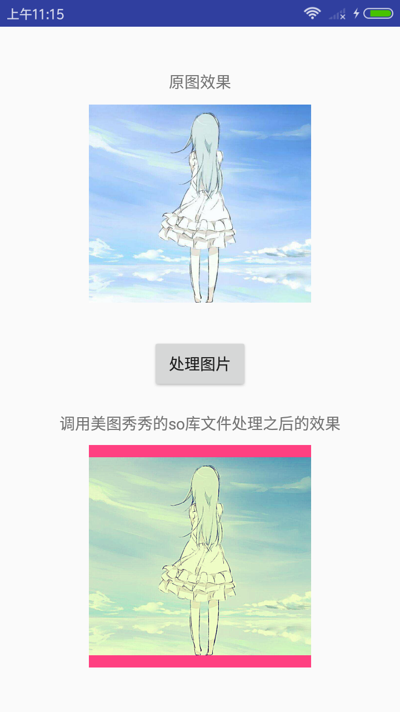

这里提供美图秀秀非常早先的一个版本(相关资源文章最后给出)，我们使用AndroidKill反编译该apk，
然后获取到美图秀秀的源代码以及so库文件，然后尝试在自己的程序中调用美图秀秀的so库文件，
实现美图秀秀美化图片的功能。

一、首先看一下美图秀秀处理图片的流程和效果，apk安装完毕，可以看到软件logo


接着打开软件进入软件首页，进入美图秀秀首页


点击美化图片按钮，进入图片选择页面


点击从相册中选择，然后选取一张图片，选择图片特效，然后选择经典HDR，就可以看到图片效果了

首先是原图



处理之后：


1、TopViewActivity的关键代码：

```markdown

public class TopViewActivity
  extends Activity
{
  public static int backID;
  public int Background;
  private Button btn_about;
  private Button btn_beautyPic;//注释：美化图片
  private Button btn_newboyhelp;
  private Button btn_set;
  private TextView btn_versionName;
  private LinearLayout buttonsLayout;

  ...代码省略...

  public void onCreate(Bundle paramBundle)
  {
    getWindow().setFlags(1024, 1024);
    super.onCreate(paramBundle);
    setContentView(2130903055);
    findView();
    this.tipAnimation = AnimationUtils.loadAnimation(this, 2130968592);
    this.btn_beautyPic.setOnClickListener(new OnClickListenerBeautyPic());//注释：设置点击事件
    this.btn_beautyPic.setOnTouchListener(new OnTouchListenerBeautyPic());
    this.btn_newboyhelp.setOnTouchListener(new OnTouchListenerNewboyhelp());
    this.btn_newboyhelp.setOnClickListener(new OnClickListenerNewboyhelp());
    this.btn_about.setOnTouchListener(new OnTouchListenerAbout());
    this.btn_about.setOnClickListener(new OnClickListenerAbout());
    this.btn_set.setOnTouchListener(new OnTouchListenerSet());
    this.btn_set.setOnClickListener(new OnClickListenerSet());
    getName();
    this.btn_versionName.setText(this.versionName + " 正式版");
    this.btn_versionName.setTextSize(12.0F);
  }
  
  ...代码省略...
  
  class OnClickListenerBeautyPic
    implements View.OnClickListener
  {
    OnClickListenerBeautyPic() {}
    
    public void onClick(View paramView)
    {
       //注释：打开ChoosePicActivity页面,这样我们就去看ChoosePicActivity的具体代码
      paramView = new Intent(TopViewActivity.this, ChoosePicActivity.class);
      TopViewActivity.this.startActivity(paramView);
      TopViewActivity.this.overridePendingTransition(2130968576, 2130968577);
    }
  }
  
  ...代码省略...

}
```

上面代码

最近碰见了一个错误： 
ibhyphenate_av.so: has text relocations 

错误产生的原因是 在 小米 Android 6.0系统中，app安装成功后 点击无法启动app。 

当时没有设备，无法进行调试。 后来调试后发现 不是无法启动app。而是启动app 的时候瞬间就崩溃了。 然后什么提示都没有 就给用户产生了一个 点击无法启动app 的错觉。

联机调试后 发现错误就是上面的那个了。

前面的那个so库是环信的支持库。 

解决方法：

将 targetSdkVersion 的值调整为23以下就可以了。 主要是因为环信的so库生成的时候的targetSdkVersion过低 没有达到23.所以就会出现了这个错误。

而去这个错误，在6.0以下的手机中你是测试不出来的。只有在6.0以上的系统才会出现这个bug。

总结： 如果使用了第三方的so库那么 就得注意你自己的targetSdkVersio 的值了。 


步骤1：
  class OnClickListenerBeautyPic
    implements View.OnClickListener
  {
    OnClickListenerBeautyPic() {}
    
    public void onClick(View paramView)
    {
      paramView = new Intent(TopViewActivity.this, ChoosePicActivity.class);
      TopViewActivity.this.startActivity(paramView);
      TopViewActivity.this.overridePendingTransition(2130968576, 2130968577);
    }
  }