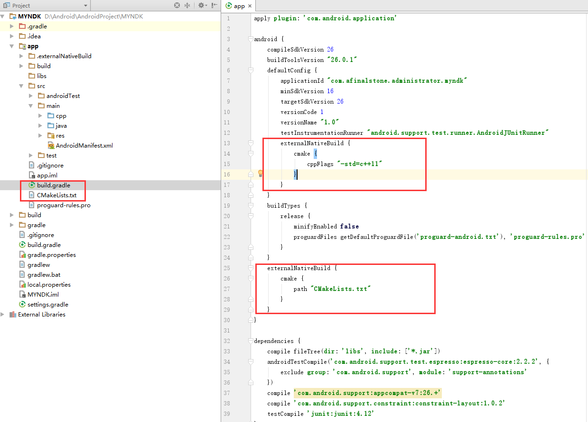
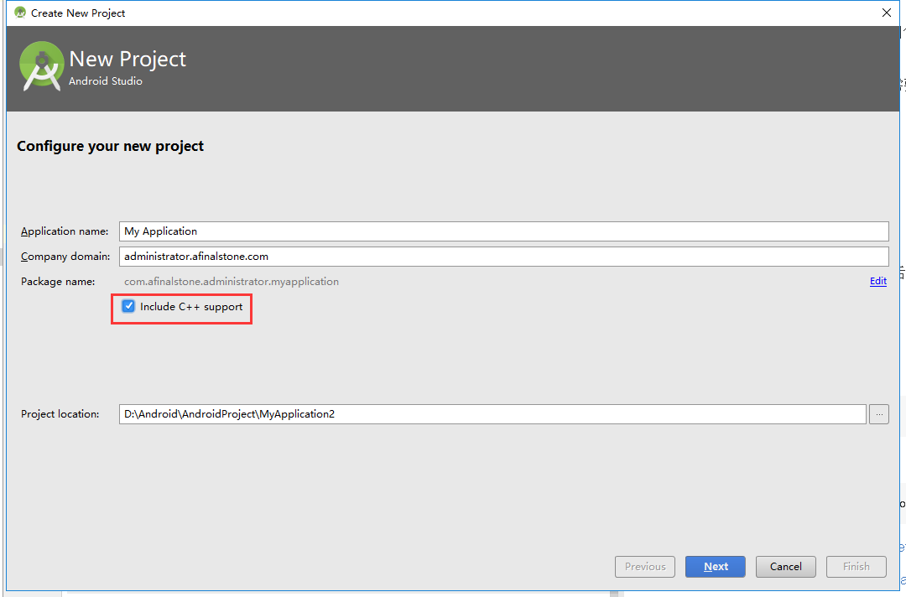
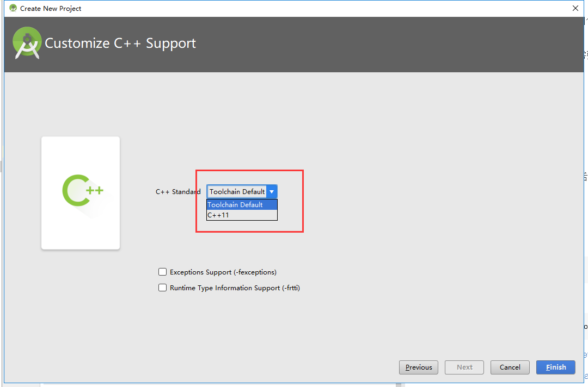
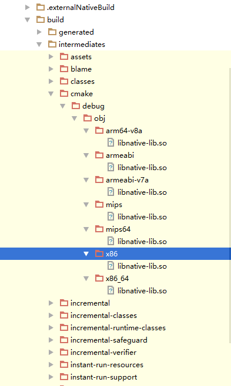

## NDK学习笔记<七> 使用AndroidStudio本身，编译C/C++文件生成SO文件

之前的项目我们基本都是使用Ndk-build的命令行来编译C/C++文件生成.so库文件的。本篇我们使用AndroidStudio的RebuildProject来编译C/C++文件，生成我们需要的.so库文件。

### 一、给已经存在的项目配置AndroidStudio开发NDK的环境

1、在我们的项目中的app中的build.gradle中添加

defaultConfig｛｝后面添加：

```gradle
  externalNativeBuild {
      cmake {
          cppFlags "-std=c++11"
      }
  }
```

或者：

```gradle
  externalNativeBuild {
      cmake {
          cppFlags ""
      }
  }
```

cmake在编译C/C++代码的时候，回根据上面的两种不同设置来使用C++的两种不同标准，C++11或者默认标准

android {｝后面添加：

```gradle
    externalNativeBuild {
        cmake {
            path "CMakeLists.txt"
        }
    }
```


整个build.gradle的内容如下：

```gradle

apply plugin: 'com.android.application'

android {
    compileSdkVersion 25
    buildToolsVersion "25.0.1"

    defaultConfig {
        applicationId "com.afinalstone.administrator.ndk_07_buildbyas"
        minSdkVersion 16
        targetSdkVersion 25
        versionCode 1
        versionName "1.0"
        testInstrumentationRunner "android.support.test.runner.AndroidJUnitRunner"
        externalNativeBuild {
            cmake {
                cppFlags "-std=c++11"
            }
        }
    }
    buildTypes {
        release {
            minifyEnabled false
            proguardFiles getDefaultProguardFile('proguard-android.txt'), 'proguard-rules.pro'
        }
    }
    externalNativeBuild {
        cmake {
            path "CMakeLists.txt"
        }
    }
}

dependencies {
    compile fileTree(dir: 'libs', include: ['*.jar'])
    androidTestCompile('com.android.support.test.espresso:espresso-core:2.2.2', {
        exclude group: 'com.android.support', module: 'support-annotations'
    })
    compile 'com.android.support:appcompat-v7:25.+'
    compile 'com.android.support.constraint:constraint-layout:1.0.2'
    testCompile 'junit:junit:4.12'
}

```

2、在我们的项目中的app根目录添加CMakeLists.txt文件，具体内容如下：

```
# For more information about using CMake with Android Studio, read the
# documentation: https://d.android.com/studio/projects/add-native-code.html

# Sets the minimum version of CMake required to build the native library.

cmake_minimum_required(VERSION 3.4.1)

# Creates and names a library, sets it as either STATIC
# or SHARED, and provides the relative paths to its source code.
# You can define multiple libraries, and CMake builds them for you.
# Gradle automatically packages shared libraries with your APK.

add_library( # Sets the name of the library.
             native-lib

             # Sets the library as a shared library.
             SHARED

             # Provides a relative path to your source file(s).
             src/main/cpp/native-lib.cpp )

# Searches for a specified prebuilt library and stores the path as a
# variable. Because CMake includes system libraries in the search path by
# default, you only need to specify the name of the public NDK library
# you want to add. CMake verifies that the library exists before
# completing its build.

find_library( # Sets the name of the path variable.
              log-lib

              # Specifies the name of the NDK library that
              # you want CMake to locate.
              log )

# Specifies libraries CMake should link to your target library. You
# can link multiple libraries, such as libraries you define in this
# build script, prebuilt third-party libraries, or system libraries.

target_link_libraries( # Specifies the target library.
                       native-lib

                       # Links the target library to the log library
                       # included in the NDK.
                       ${log-lib} )
```

到这里查看一下我们的整个项目结构：



### 二、新建自带AndroidStudio开发NDK环境的项目

New Project之后，需要注意下面两个页面：






### 三、编译生成.so库文件

点击Build->Rebuild Project，重新编译整个项目包括.so库文件。



这样我们打包生成的app里面就自动包含我们需要的.so库文件。

### 四、NDK需要注意的方面：

- 关于NDK部分文件的后缀名：

1>使用C++来写代码，文件名就必须以.cpp为后缀，.c后缀不行；

2>使用C来写代码，文件名就必须以.c为后缀；

- 关于代码的调用：

1>C格式
```
return (*env)->NewStringUTF(env, "Hello JNI !");
```
2>C++格式
```
 return env->NewStringUTF((char *)"Hello JNI !");
```


参考文章：http://blog.csdn.net/krubo1/article/details/50547681

JNI错误总结：http://www.cnblogs.com/xingyun/archive/2012/08/03/2622410.html

C和C++代码的区别：http://blog.csdn.net/forandever/article/details/50396058

Javap的使用：http://www.365mini.com/page/javap-disassemble-class-file-code.htm

cmake使用示例与整理总结：http://blog.csdn.net/wzzfeitian/article/details/40963457


项目地址：[传送门](https://github.com/AFinalStone/MYJNI)